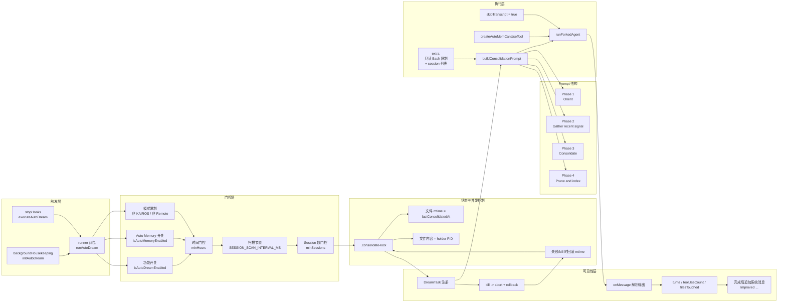
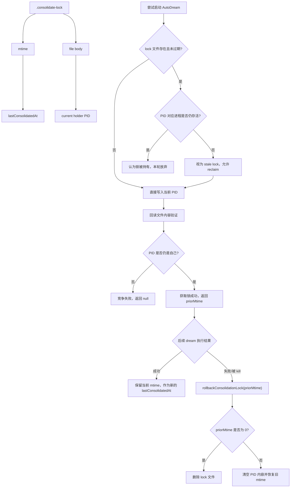
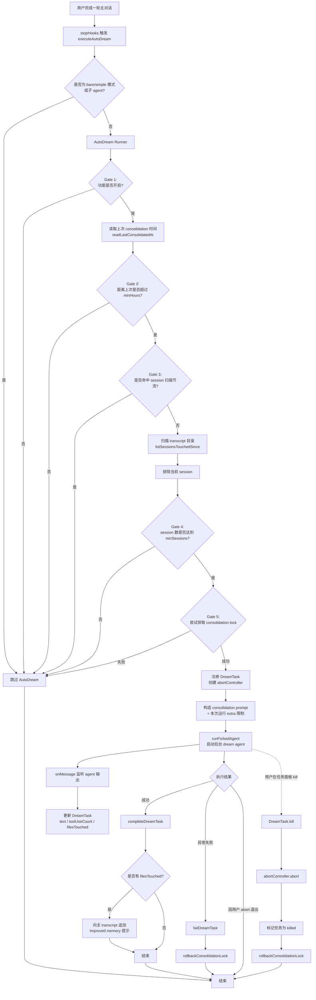
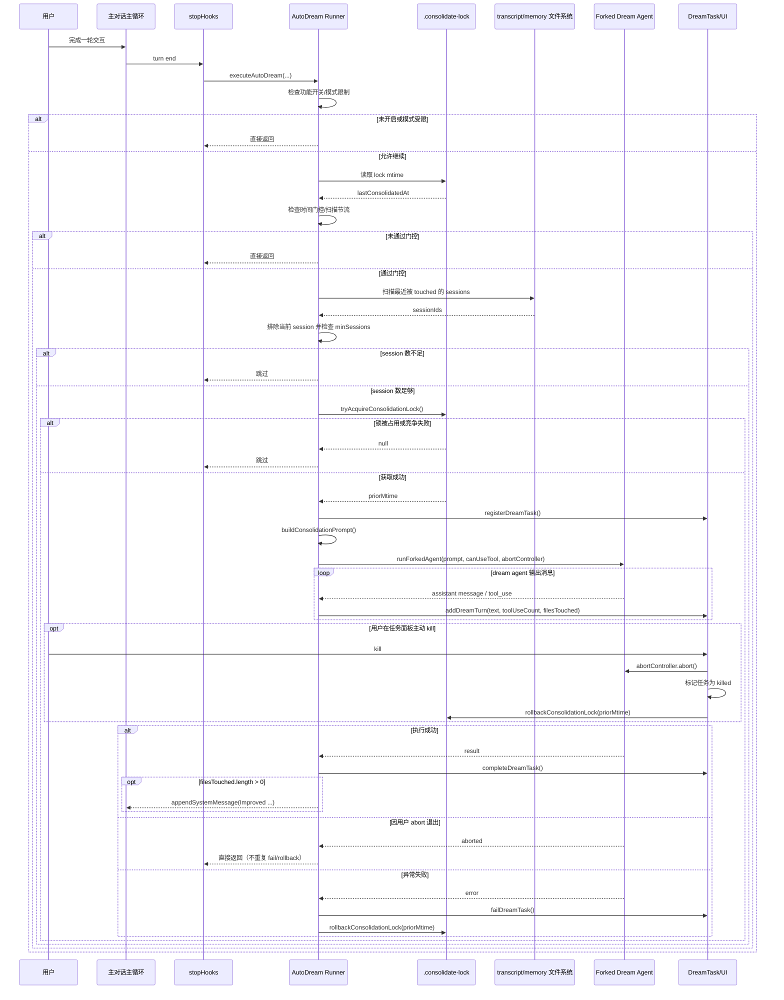

> 基于 `src/services/autoDream/` 及相关模块的完整代码阅读  
> 核心文件：`autoDream.ts` / `consolidationLock.ts` / `consolidationPrompt.ts` / `config.ts` / `DreamTask.ts`

---

## 1. 功能定位与设计动机

### 1.1 是什么

AutoDream 是 Claude Code 的**后台记忆整合系统**。它会在满足时间和会话数量双重条件时，自动 fork 一个子 agent，对 `~/.claude/projects/<git-root>/memory/` 目录下的长期记忆文件执行四阶段的"反思与整合"操作。

文件头注释直接说明了它的本质：

```
// Background memory consolidation. Fires the /dream prompt as a forked
// subagent when time-gate passes AND enough sessions have accumulated.
```

### 1.2 解决什么问题

Claude Code 的 `extractMemories` 机制在每轮对话结束时实时提取记忆，写入 memory 目录。这产生了两个长期问题：

1. **记忆碎片化**：多个会话写入的记忆可能重复、矛盾或表达不一致
2. **索引膨胀**：`MEMORY.md`（入口索引）会随时间膨胀，超出上下文窗口限制（200 行截断）

AutoDream 的角色是**定期整合者**：它不负责实时写入，而是负责把零散积累的记忆合并、修正、去重，维护记忆系统的长期健康。

### 1.3 与 /dream 命令的关系

AutoDream 的 prompt 逻辑（`consolidationPrompt.ts`）从 `dream.ts` 中独立提取，原因是：

```typescript
// Extracted from dream.ts so auto-dream ships independently of KAIROS
// feature flags (dream.ts is behind a feature()-gated require).
```

`/dream` 是手动触发的斜杠命令，位于 KAIROS feature flag 后面。AutoDream 则不依赖 KAIROS，独立运行。两者共享同一套四阶段 prompt 结构，但 AutoDream 的工具权限更严格（只读 Bash），而手动 `/dream` 在主循环中运行，拥有正常权限。

---

## 2. 整体架构

### 2.1 模块结构

```
src/services/autoDream/
├── autoDream.ts          # 主调度器：门控判断、lock 获取、fork 启动、收尾
├── config.ts             # 轻量叶子模块：是否启用的单一职责判断
├── consolidationLock.ts  # 锁文件管理：mtime 复用为 lastConsolidatedAt
└── consolidationPrompt.ts # 四阶段 prompt 构建（与 KAIROS 解耦）

src/tasks/DreamTask/
└── DreamTask.ts          # UI 可见性：任务注册、进度更新、kill 支持

src/components/tasks/
└── DreamDetailDialog.tsx # TUI 对话框：实时展示 dream agent 的推理文本

src/utils/
└── backgroundHousekeeping.ts  # 启动入口：initAutoDream() 在此调用

src/query/
└── stopHooks.ts          # 每轮触发点：executeAutoDream() 在每轮结束后调用
```

### 2.2 模块依赖原则

`config.ts` 被特意设计为**轻依赖叶子模块**：

```typescript
// Leaf config module — intentionally minimal imports so UI components
// can read the auto-dream enabled state without dragging in the forked
// agent / task registry / message builder chain that autoDream.ts pulls in.
```

这使得 UI 组件（如 `MemoryFileSelector.tsx`）可以直接读取 `isAutoDreamEnabled()` 状态，而不会因为引入 `autoDream.ts` 导致把 forkedAgent、taskRegistry、messageBuilder 等重依赖链条拖进渲染路径。这是 CLI/React 混合架构中常见的依赖分层策略。

### 2.3 生命周期

```
进程启动
  └── startBackgroundHousekeeping()
        └── initAutoDream()           ← 初始化闭包，注册 runner

每轮对话结束
  └── handleStopHooks()
        └── executeAutoDream()        ← 调用 runner（若 null 则 no-op）
              └── runAutoDream()
                    ├── 门控检查（廉价优先）
                    ├── tryAcquireConsolidationLock()
                    ├── registerDreamTask()           ← 注册到 UI
                    ├── runForkedAgent()              ← 启动 dream agent
                    └── completeDreamTask() / failDreamTask() / rollback
```

### 2.4 分层架构关系图



这张图表达的是**分层依赖关系**，不是严格的时序图，因此将“初始化 runner”“门控”“锁状态”“执行器”“Prompt 结构”“UI 可见性”分别拆层展示。和第 15 节的执行流程图配合阅读，可以同时看到"系统由哪些层组成"与"一次 dream 实际如何流转"。

---

## 3. 触发门控系统（Gate System）

### 3.1 设计原则：廉价优先

门控检查按成本从低到高排列，任何一关不通则立即返回，不进入后续更昂贵的操作：

```typescript
// Gate order (cheapest first):
//   1. Time: hours since lastConsolidatedAt >= minHours (one stat)
//   2. Sessions: transcript count with mtime > lastConsolidatedAt >= minSessions
//   3. Lock: no other process mid-consolidation
```

### 3.2 总开关门控（isGateOpen）

```typescript
function isGateOpen(): boolean {
  if (getKairosActive()) return false  // KAIROS 模式有自己的 dream 机制
  if (getIsRemoteMode()) return false  // 远程模式禁用
  if (!isAutoMemoryEnabled()) return false  // 自动记忆必须开启
  return isAutoDreamEnabled()          // 最终检查用户设置 / GrowthBook
}
```

四个条件的语义：
- **KAIROS 模式**：KAIROS 有基于磁盘 skill 的 dream 机制，AutoDream 不重复介入
- **远程模式**：CCR 远程容器环境下不触发
- **autoMemory 开关**：记忆目录不存在或被禁用时没有整合目标
- **autoDream 开关**：用户配置或 GrowthBook 实验平台的双重控制

### 3.3 时间门控

```typescript
const hoursSince = (Date.now() - lastAt) / 3_600_000
if (!force && hoursSince < cfg.minHours) return
```

`lastAt` 来自锁文件的 `mtime`（详见第 4 节），默认 `minHours = 24`。时间门控的成本仅为一次 `fs.stat()`。

### 3.4 扫描节流（Scan Throttle）

时间门通过后，在进入成本更高的"扫描 session 文件"之前，还有一道节流：

```typescript
const SESSION_SCAN_INTERVAL_MS = 10 * 60 * 1000  // 10 分钟

const sinceScanMs = Date.now() - lastSessionScanAt
if (!force && sinceScanMs < SESSION_SCAN_INTERVAL_MS) return
lastSessionScanAt = Date.now()  // 注意：在扫描前更新，不是扫描后
```

**设计动机**：若时间门已过但 session 数量还不够，lock 文件的 mtime 不会更新，导致时间门每轮都通过，形成无意义的高频 session 目录扫描。10 分钟节流避免了这种"热空转"。

注意时间戳在扫描前就更新，这样即使本轮 session 数不足，节流也能生效。

### 3.5 Session 门控

```typescript
sessionIds = await listSessionsTouchedSince(lastAt)
// 排除当前 session（mtime 天然是最新的，不能计入"新增"）
sessionIds = sessionIds.filter(id => id !== currentSession)
if (!force && sessionIds.length < cfg.minSessions) return
```

`listSessionsTouchedSince` 通过文件 `mtime`（而非 `birthtime`，因为 ext4 等文件系统 birthtime 不可靠）统计自上次 consolidation 以来被"触碰"过的 session 数量。

默认 `minSessions = 5`，表示 AutoDream 的目标是"低频但有价值"的整合，而不是频繁小修小补。

### 3.6 完整门控流程图

```
executeAutoDream()
       │
       ▼
 isGateOpen()? ─── No ──→ return（KAIROS / remote / mem disabled / dream disabled）
       │ Yes
       ▼
 readLastConsolidatedAt()  ←── stat(lock file).mtime，成本最低
       │
 hoursSince < minHours? ─── Yes ──→ return
       │ No
       ▼
 sinceScanMs < 10min? ──── Yes ──→ return（scan throttle）
       │ No
       ▼
 listSessionsTouchedSince()  ←── 扫描 session 目录，成本较高
       │
 sessionCount < minSessions? ── Yes ──→ return
       │ No
       ▼
 tryAcquireConsolidationLock()
       │
 null（被占）? ──────────────── Yes ──→ return
       │ No（获取成功）
       ▼
 runForkedAgent()  ←── 启动 dream agent，成本最高
```

---

## 4. 锁机制：mtime 即状态

`consolidationLock.ts` 是整个系统最精巧的设计之一。

### 4.1 单文件双语义

```
文件路径：<autoMemPath>/.consolidate-lock
文件内容：当前持锁进程的 PID
文件 mtime：上次成功 consolidation 的时间戳
```

一个文件同时承载两个语义：**锁的持有者（PID）** 和 **上次整合时间（mtime）**。避免了多份状态之间的同步问题，且 mtime 的读取成本仅为一次 `stat()`。

```typescript
export async function readLastConsolidatedAt(): Promise<number> {
  try {
    const s = await stat(lockPath())
    return s.mtimeMs
  } catch {
    return 0  // 文件不存在 = 从未整合过
  }
}
```

### 4.2 轻量竞争锁（乐观并发控制）

`tryAcquireConsolidationLock()` 不使用重量级文件锁（如 `flock`），而是采用"写入后回读验证"的轻量方案：

```typescript
// Step 1: 并行读取 mtime 和持锁 PID
const [s, raw] = await Promise.all([stat(path), readFile(path, 'utf8')])

// Step 2: 如果锁未过期且持有者仍在运行，则退出
if (mtimeMs !== undefined && Date.now() - mtimeMs < HOLDER_STALE_MS) {
  if (holderPid !== undefined && isProcessRunning(holderPid)) {
    return null  // 被占，返回 null 表示"正常竞争失败"
  }
  // PID 已死或内容不可解析 → 允许 reclaim
}

// Step 3: 写入当前 PID（writeFile 自动刷新 mtime）
await writeFile(path, String(process.pid))

// Step 4: 回读验证——两个进程同时 reclaim，最终只有一个 PID 留下
const verify = await readFile(path, 'utf8')
if (parseInt(verify.trim(), 10) !== process.pid) return null  // 竞争失败

return mtimeMs ?? 0  // 返回旧 mtime 供回滚用
```

**竞争处理**：两个进程同时写入时，最后写入的 PID 获胜。输者在回读验证时发现 PID 不是自己，主动退出。这是 O(1) 的轻量竞争方案。

### 4.3 过期保护（PID 复用防护）

```typescript
const HOLDER_STALE_MS = 60 * 60 * 1000  // 1 小时

// 即使 PID 看起来活着，超过 1 小时也强制 reclaim
if (Date.now() - mtimeMs < HOLDER_STALE_MS) { ... }
```

防止 PID 复用导致误判：OS 的 PID 是可复用的，一个新进程可能恰好分配到和旧 dream agent 相同的 PID。1 小时过期窗口确保即使发生 PID 复用，锁也不会永久卡死。

### 4.4 回滚机制

当 fork 失败或用户强制终止时，必须将 lock 文件的 mtime 恢复到**获取锁之前的状态**，否则系统会误以为刚完成了一次整合，从而推迟下一次触发：

```typescript
export async function rollbackConsolidationLock(priorMtime: number): Promise<void> {
  if (priorMtime === 0) {
    await unlink(path)    // 之前没有锁文件 → 删掉恢复原状
    return
  }
  await writeFile(path, '')      // 清空 PID（让当前进程不再"看起来持有"）
  const t = priorMtime / 1000
  await utimes(path, t, t)       // 把 mtime 改回旧值
}
```

`utimes` 是这个设计的关键：它允许精确恢复文件的 mtime，从而精确恢复"上次整合时间"这个语义。

### 4.4.1 锁文件状态机图



这张图强调的是：`.consolidate-lock` 不是单纯的互斥锁，而是同时承担了**并发控制**和**调度状态记录**两种职责。成功时保留新的 mtime；失败或用户 kill 时，则通过 `priorMtime` 精确回滚到启动前状态。

### 4.5 手动 /dream 的乐观记录

```typescript
export async function recordConsolidation(): Promise<void> {
  // 手动触发时，乐观地在 prompt-build 阶段就写锁，而不是等待完成后回调
  await writeFile(lockPath(), String(process.pid))
}
```

手动 `/dream` 不等待整合完成再记录，而是在 prompt 构建时就写入。这是"尽力而为"的语义——实现最简，代价是如果 `/dream` 中途失败，下次 AutoDream 检查可能被错误延后。注释中明确说明这是 best-effort，不追求严格事务性。

---

## 5. Forked Agent 执行

### 5.1 runForkedAgent 调用

```typescript
const result = await runForkedAgent({
  promptMessages: [createUserMessage({ content: prompt })],
  cacheSafeParams: createCacheSafeParams(context),  // 复用主会话 prompt cache
  canUseTool: createAutoMemCanUseTool(memoryRoot),  // 受限工具权限
  querySource: 'auto_dream',
  forkLabel: 'auto_dream',
  skipTranscript: true,     // 不写转录文件（后台任务不需要持久化记录）
  overrides: { abortController },   // 允许用户从 UI 终止
  onMessage: makeDreamProgressWatcher(taskId, setAppState),  // 实时进度
})
```

### 5.2 Prompt Cache 复用

`createCacheSafeParams(context)` 从当前 REPL 上下文中提取已渲染的 system prompt 字节，直接传给 forked agent。这确保：

1. dream agent 与主会话的 system prompt 完全一致（字节级别）
2. 不触发 Feature Flag 的重新计算（若有 Flag 在主会话启动后状态变化）
3. **直接命中主会话在 Anthropic 服务器端的 prompt cache**

这是 AutoDream 的核心成本优化——dream agent 的 system prompt token 几乎全部命中缓存，边际成本趋近于零。

### 5.3 skipTranscript

AutoDream 设置 `skipTranscript: true`，dream agent 的中间过程不写转录文件。原因是：
- 后台任务的中间推理对用户价值有限，不需要持久化
- 避免在 transcript 目录产生大量 dream 相关的 JSONL 文件污染会话历史

### 5.4 AbortController 集成

每次 dream 启动时创建一个 `AbortController`，传入 `DreamTaskState` 和 `runForkedAgent`：

```typescript
const abortController = new AbortController()
const taskId = registerDreamTask(setAppState, {
  sessionsReviewing: sessionIds.length,
  priorMtime,
  abortController,  // ← 存入 DreamTask 供用户 kill
})
```

用户在 TUI 中按 `x` 终止 dream 时，`DreamTask.kill()` 调用 `abortController.abort()`，同时触发 `rollbackConsolidationLock(priorMtime)` 回滚锁状态。

---

## 6. 四阶段 Consolidation Prompt

`consolidationPrompt.ts` 中的 `buildConsolidationPrompt()` 定义了 dream agent 的工作规范，分为四个严格顺序的阶段。

### 6.1 Phase 1 — Orient（定向）

```markdown
## Phase 1 — Orient
- `ls` the memory directory to see what already exists
- Read `MEMORY.md` to understand the current index
- Skim existing topic files so you improve them rather than creating duplicates
- If `logs/` or `sessions/` subdirectories exist, review recent entries there
```

**设计意图**：先理解"已有记忆长什么样"，再决定写什么。这防止 agent 盲目追加内容，也防止创建重复的 topic 文件。Phase 1 是纯读取阶段，不做任何写入。

### 6.2 Phase 2 — Gather（采集）

```markdown
## Phase 2 — Gather recent signal
Sources in rough priority order:
1. Daily logs (`logs/YYYY/MM/YYYY-MM-DD.md`) — append-only stream
2. Existing memories that drifted — facts that contradict codebase now
3. Transcript search — grep narrowly, don't read whole files
```

**三层优先级**：日志文件（结构化、增量）→ 已有记忆的漂移检测 → 按需的 transcript 窄范围搜索。

关键约束：`Don't exhaustively read transcripts. Look only for things you already suspect matter.`

AutoDream 不是全量索引器，只在"已经怀疑某件事重要"时才去 grep transcript，严格控制成本和噪音。

### 6.3 Phase 3 — Consolidate（整合）

```markdown
## Phase 3 — Consolidate
Focus on:
- Merging new signal into existing topic files rather than creating near-duplicates
- Converting relative dates ("yesterday", "last week") to absolute dates
- Deleting contradicted facts — if today's investigation disproves an old memory, fix it
```

**三个核心动作**：
1. **合并**：新信号并入已有 topic 文件，而非另建文件
2. **时间绝对化**：相对日期（"昨天"）转换为绝对日期，确保记忆跨时间可读
3. **纠错**：发现旧记忆与当前事实矛盾时，直接修正旧记忆（而不是追加"更正"）

Phase 3 才真正落盘写 memory 文件，且必须遵守系统 prompt 中 auto-memory 的格式规范（frontmatter + type 字段）。

### 6.4 Phase 4 — Prune and Index（修剪与索引）

```markdown
## Phase 4 — Prune and index
Update `MEMORY.md` so it stays under 200 lines AND under ~25KB.
- Each entry: one line under ~150 characters: `- [Title](file.md) — one-line hook`
- Remove stale, wrong, or superseded pointers
- Demote verbose entries (>200 chars → move detail to topic file)
- Resolve contradictions between files
```

**MEMORY.md 的约束**：
- 最多 200 行（超过后被截断，不再加载到上下文）
- 每条索引 ≤150 字符，仅作导览，不放正文
- 过长的索引行（>200 字符）说明内容应该移到 topic 文件

Phase 4 决定了用户下次启动 Claude Code 时能看到多少长期记忆。

### 6.5 Extra 注入机制

```typescript
const extra = `
**Tool constraints for this run:** Bash is restricted to read-only commands...

Sessions since last consolidation (${sessionIds.length}):
${sessionIds.map(id => `- ${id}`).join('\n')}`

const prompt = buildConsolidationPrompt(memoryRoot, transcriptDir, extra)
```

`extra` 作为独立的 `## Additional context` 段追加到 prompt 末尾，不混入主 prompt 正文。这将"稳定的规则定义"和"本次运行的临时信息"分层——工具约束、session 列表属于运行时上下文，而四阶段规范是 dream 的通用定义，这样"稳定部分"对 prompt cache 更友好。

---

## 7. 权限沙箱：createAutoMemCanUseTool

AutoDream 使用严格的权限沙箱，与 `extractMemories` 共享同一套 `createAutoMemCanUseTool(memoryDir)` 实现：

```typescript
export function createAutoMemCanUseTool(memoryDir: string): CanUseToolFn {
  return async (tool, input) => {
    // 1. 允许 Read / Grep / Glob（纯只读，无限制）
    if ([FILE_READ, GREP, GLOB].includes(tool.name)) {
      return { behavior: 'allow', updatedInput: input }
    }

    // 2. 允许 Bash，但仅限通过 isReadOnly() 检查的命令
    //    (ls, find, grep, cat, stat, wc, head, tail 等)
    if (tool.name === BASH) {
      const parsed = tool.inputSchema.safeParse(input)
      if (parsed.success && tool.isReadOnly(parsed.data)) {
        return { behavior: 'allow', updatedInput: input }
      }
      return denyAutoMemTool(tool, 'Only read-only shell commands are permitted...')
    }

    // 3. 允许 FileEdit / FileWrite，但必须写入 autoMem 目录内
    if ([FILE_EDIT, FILE_WRITE].includes(tool.name) && 'file_path' in input) {
      if (typeof filePath === 'string' && isAutoMemPath(filePath)) {
        return { behavior: 'allow', updatedInput: input }
      }
    }

    // 4. 其他一切拒绝
    return denyAutoMemTool(tool, `only read + autoMem writes allowed`)
  }
}
```

**沙箱规则总结**：

| 工具 | 权限 | 约束 |
|------|------|------|
| Read / Grep / Glob | ✅ 完全允许 | 无 |
| Bash | ✅ 有条件允许 | 必须通过 `isReadOnly()` 检查 |
| FileEdit / FileWrite | ✅ 有条件允许 | 路径必须在 `autoMemPath` 内 |
| 其他所有工具 | ❌ 拒绝 | 包括 Agent、TodoWrite、Web 等 |

**拒绝时的副作用**：每次工具拒绝都会触发遥测事件 `tengu_auto_mem_tool_denied`，包含被拒工具名（已脱敏）。这为 Anthropic 提供了"dream agent 在真实场景下需要哪些工具"的观测数据。

### 7.1 一个容易忽略的细节：REPL 也被允许

源码里 `createAutoMemCanUseTool()` 还特判放行了 `REPL` 工具：

```typescript
if (tool.name === REPL_TOOL_NAME) {
  return { behavior: 'allow', updatedInput: input }
}
```

这并不意味着 dream agent 获得了更高权限。REPL 只是外层壳；在 REPL 模式下，内部原子工具（Read/Bash/Edit/Write）仍会再次经过同一个 `canUseTool` 检查，真正的读写边界没有放松。

源码注释还解释了更深一层原因：如果为了 AutoDream 单独裁剪工具列表，会破坏 prompt cache 共享，因为**工具列表本身就是 cache key 的一部分**。因此这里采用的是"允许 REPL 外壳存在，但继续在内部原子工具层做权限约束"的折中方案，兼顾缓存命中率与安全性。

---

## 8. DreamTask：UI 可见性层

### 8.1 设计动机

```typescript
// Background task entry for auto-dream (memory consolidation subagent).
// Makes the otherwise-invisible forked agent visible in the footer pill and
// Shift+Down dialog. The dream agent itself is unchanged — this is pure UI
// surfacing via the existing task registry.
```

AutoDream 的 forked agent 本质上是完全后台运行的，用户在不看任务列表时感知不到。`DreamTask` 的作用是把这个"不可见的后台 agent"接入现有的 Task 注册表，让用户可以：
- 在底部状态栏看到"dreaming"标识
- 通过 `Shift+Down` 打开 `DreamDetailDialog` 查看实时推理进度
- 按 `x` 键主动终止

### 8.2 两阶段状态机

```typescript
export type DreamPhase = 'starting' | 'updating'
```

Phase 检测不解析 prompt 的具体阶段（Orient/Gather/Consolidate/Prune），而是用一个简单的信号：**第一个 FileEdit/FileWrite tool_use 出现时**，从 `starting` 翻转为 `updating`。

```typescript
return {
  ...task,
  phase: newTouched.length > 0 ? 'updating' : task.phase,
  filesTouched: [...task.filesTouched, ...newTouched],
  turns: task.turns.slice(-(MAX_TURNS - 1)).concat(turn),
}
```

这个设计非常务实：用"是否开始写文件"来判断是否进入实质工作阶段，简洁且准确。

### 8.3 Turn 缓冲

```typescript
const MAX_TURNS = 30
turns: task.turns.slice(-(MAX_TURNS - 1)).concat(turn)
```

只保留最近 30 轮 assistant 消息，防止长时间 dream 把内存撑爆，同时 TUI 也只展示最近 6 轮（`VISIBLE_TURNS = 6`），更早的折叠为计数显示。

### 8.4 filesTouched 的注意事项

```typescript
/**
 * Paths observed in Edit/Write tool_use blocks via onMessage. This is an
 * INCOMPLETE reflection of what the dream agent actually changed — it misses
 * any bash-mediated writes and only captures the tool calls we pattern-match.
 * Treat as "at least these were touched", not "only these were touched".
 */
filesTouched: string[]
```

`filesTouched` 只通过模式匹配 `FileEdit`/`FileWrite` 的 `tool_use` 块来追踪。如果 dream agent 用 Bash 写文件（虽然权限沙箱不允许，但理论上），不会被记录。这是一个明确接受的"至少"语义。

### 8.5 Kill 与锁回滚的联动

```typescript
async kill(taskId, setAppState) {
  updateTaskState<DreamTaskState>(taskId, setAppState, task => {
    task.abortController?.abort()   // 终止 forked agent
    priorMtime = task.priorMtime
    return { ...task, status: 'killed', ... }
  })
  // 回滚 lock mtime，让下次 session 可以重试
  if (priorMtime !== undefined) {
    await rollbackConsolidationLock(priorMtime)
  }
}
```

Kill 操作同时做三件事：① 中止 forked agent（通过 AbortController）；② 更新 DreamTask 状态为 killed；③ 回滚锁文件的 mtime，避免因为被 kill 而错误推迟下一次触发。

### 8.6 `notified: true` 的语义

`completeDreamTask()` 与 `failDreamTask()` 都会在任务进入终态时立刻设置 `notified: true`：

```typescript
return {
  ...task,
  status: 'completed',
  endTime: Date.now(),
  notified: true,
  abortController: undefined,
}
```

这说明 DreamTask 本身**不是一个需要模型层二次通知的任务类型**。它的用户可见反馈主要有两层：
- 运行中：通过 footer pill 与 `DreamDetailDialog` 实时展示
- 完成后：通过主 transcript 中的 `appendSystemMessage(... verb: 'Improved')` 暴露结果

因此一旦任务完成或失败，任务系统就可以直接把它视为"已通知"，满足后续清理/驱逐条件，而不需要等待额外的通知链路。

---

## 9. 进度监听：makeDreamProgressWatcher

```typescript
function makeDreamProgressWatcher(taskId, setAppState) {
  return (msg: Message) => {
    if (msg.type !== 'assistant') return
    let text = ''
    let toolUseCount = 0
    const touchedPaths: string[] = []

    for (const block of msg.message.content) {
      if (block.type === 'text') {
        text += block.text                    // 推理文本，展示给用户
      } else if (block.type === 'tool_use') {
        toolUseCount++                        // tool use 折叠为计数
        if (block.name === FILE_EDIT || block.name === FILE_WRITE) {
          touchedPaths.push(block.input.file_path)  // 记录被写路径
        }
      }
    }

    addDreamTurn(taskId, { text, toolUseCount }, touchedPaths, setAppState)
  }
}
```

**设计决策**：
- **文本块**：完整保留，展示在 `DreamDetailDialog` 中，让用户能看到 agent 的推理过程
- **Tool use 块**：折叠为计数（`toolUseCount`），用户看到"执行了 N 个工具调用"而不是每个调用的细节
- **空 turn 跳过**：`text === '' && toolUseCount === 0 && newTouched.length === 0` 时不触发 state 更新，避免无意义的 re-render

---

## 10. 触发时机：stopHooks 集成

AutoDream 在 `handleStopHooks()` 中被调用，即**每轮对话结束后**：

```typescript
// src/query/stopHooks.ts
if (!isBareMode()) {
  if (!toolUseContext.agentId) {   // ← 仅在主线程，不在子 agent 中触发
    void executeAutoDream(stopHookContext, toolUseContext.appendSystemMessage)
  }
}
```

**关键约束**：
- `!toolUseContext.agentId`：只在主线程 session 中触发，子 agent（包括 dream agent 自身）不能递归触发 dream
- `void`：fire-and-forget，不 await。AutoDream 是纯后台任务，不阻塞主线程返回
- `!isBareMode()`：`--bare` 模式和 `-p/--print` 脚本模式跳过，避免后台 agent 在关闭时争用资源

`executeAutoDream` 是对 `runner?.()` 的封装：

```typescript
export async function executeAutoDream(
  context: REPLHookContext,
  appendSystemMessage?: AppendSystemMessageFn,
): Promise<void> {
  await runner?.(context, appendSystemMessage)
}
```

在 `initAutoDream()` 被调用之前，`runner` 为 `null`，`executeAutoDream` 是安全的 no-op。

---

## 11. 配置与 Feature Flag 体系

### 11.1 双层配置

```typescript
export function isAutoDreamEnabled(): boolean {
  // 优先级 1：用户显式配置
  const setting = getInitialSettings().autoDreamEnabled
  if (setting !== undefined) return setting

  // 优先级 2：GrowthBook 实验平台（tengu_onyx_plover）
  const gb = getFeatureValue_CACHED_MAY_BE_STALE<{ enabled?: unknown } | null>(
    'tengu_onyx_plover', null,
  )
  return gb?.enabled === true  // 只接受严格 true，缺失/类型错误 = 未开启
}
```

`autoDreamEnabled` 在 settings schema 中定义为可选 boolean，用户可在 `settings.json` 中显式覆盖 GrowthBook 的默认值。

### 11.2 调度参数的 GrowthBook 控制

调度参数（minHours / minSessions）通过同一个 GrowthBook flag `tengu_onyx_plover` 控制，但与启用开关分开读取（`isAutoDreamEnabled` 在 `config.ts`，`getConfig` 在 `autoDream.ts`）：

```typescript
function getConfig(): AutoDreamConfig {
  const raw = getFeatureValue_CACHED_MAY_BE_STALE<Partial<AutoDreamConfig> | null>(
    'tengu_onyx_plover', null,
  )
  return {
    minHours: typeof raw?.minHours === 'number' && Number.isFinite(raw.minHours) && raw.minHours > 0
      ? raw.minHours : DEFAULTS.minHours,   // 默认 24 小时
    minSessions: typeof raw?.minSessions === 'number' && ...
      ? raw.minSessions : DEFAULTS.minSessions,  // 默认 5 个 session
  }
}
```

每个字段独立进行类型和数值校验，防御 GrowthBook 缓存值陈旧或类型错误。

### 11.3 ConfigTool 暴露

```typescript
// src/tools/ConfigTool/supportedSettings.ts
autoDreamEnabled: {
  source: 'settings',
  type: 'boolean',
  description: 'Enable background memory consolidation',
}
```

用户可以通过 `/config` 命令在 TUI 内直接切换 AutoDream 开关，同时 `MemoryFileSelector.tsx` 展示当前状态和上次整合时间。

---

## 12. 错误处理与容错设计

### 12.1 错误不上浮原则

AutoDream 所有错误均在内部处理，不向用户抛出：

```typescript
try {
  lastAt = await readLastConsolidatedAt()
} catch (e: unknown) {
  logForDebugging(`[autoDream] readLastConsolidatedAt failed: ${e.message}`)
  return  // 静默跳过，不影响主线程
}
```

每个关键操作都有独立的 try-catch，失败时 `logForDebugging`（仅在 debug 模式可见）并直接 return，不会把后台任务的错误暴露给用户。

### 12.2 Fork 失败的回滚

```typescript
} catch (e: unknown) {
  if (abortController.signal.aborted) {
    logForDebugging('[autoDream] aborted by user')
    return  // 用户主动 kill，DreamTask.kill 已处理好状态
  }
  logForDebugging(`[autoDream] fork failed: ${e.message}`)
  logEvent('tengu_auto_dream_failed', {})
  failDreamTask(taskId, setAppState)
  await rollbackConsolidationLock(priorMtime)  // ← 关键：回滚 mtime
}
```

fork 失败时区分两种情况：
1. **用户主动 abort**：`DreamTask.kill()` 已经处理了状态更新和锁回滚，这里直接 return 不重复处理
2. **意外 fork 失败**：设置 DreamTask 为 failed，触发遥测，并回滚 lock mtime 让下次可以重试

### 12.3 Scan Throttle 作为退避机制

注释中特别说明：`rollback` 失败时，代价是下次触发被错误延后到 `minHours` 之后。`SESSION_SCAN_INTERVAL_MS`（10 分钟）也作为一种"自然退避"机制——即使在异常情况下，也不会每轮都高频扫描文件系统。

---

## 13. 与 extractMemories 的关系

AutoDream 与 `extractMemories` 是互补关系，不是重复：

| 维度 | extractMemories | AutoDream |
|------|-----------------|-----------|
| **触发频率** | 每轮对话结束（高频） | 每 24h + 5 sessions（低频） |
| **触发方式** | 实时，每轮自动 | 定期，后台 |
| **职责** | 从当轮对话提取新记忆 | 整合/修剪/修正已有记忆 |
| **写入内容** | 新增 memory 文件 | 合并、删除、修正已有文件 |
| **类比** | 实时笔记 | 定期整理笔记本 |
| **prompt cache** | 共享主会话缓存 | 共享主会话缓存 |
| **工具权限** | 共享 createAutoMemCanUseTool | 共享 createAutoMemCanUseTool |

两者共享同一套权限沙箱（`createAutoMemCanUseTool`），确保无论是实时提取还是后台整合，都无法操作 memory 目录以外的文件。

在 `stopHooks.ts` 中，两者顺序执行（都是 fire-and-forget）：

```typescript
// 先触发 extractMemories（实时提取当轮内容）
void extractMemoriesModule!.executeExtractMemories(stopHookContext, ...)
// 再触发 AutoDream（后台检查是否需要整合）
void executeAutoDream(stopHookContext, ...)
```

---

## 14. 核心设计优势分析

### 14.1 成本极低的每轮检查

AutoDream 在每轮对话结束时运行（fire-and-forget），但绝大多数情况下成本极低：

- **常规路径**：一次 GrowthBook 缓存读取（内存）+ 一次 `fs.stat()`（锁文件）
- **只在门控全部通过时**才进行 session 目录扫描和 fork

这使得 AutoDream 可以"无感"地挂在每轮 stopHook 上，而不需要单独的定时器或后台线程。

### 14.2 Prompt Cache 共享的零成本整合

`createCacheSafeParams` 复用主会话已渲染的 system prompt 字节，dream agent 的 system prompt 在 Anthropic 服务器端直接命中缓存：

```typescript
logForDebugging(
  `[autoDream] completed — cache: read=${result.totalUsage.cache_read_input_tokens} created=${result.totalUsage.cache_creation_input_tokens}`
)
```

完成时记录 cache_read vs cache_created 的比例，可用于验证缓存命中效果。在实践中，dream agent 的 system prompt（约 5-8K token）几乎全部 cache_read，真实成本仅为整合工作本身的 output token。

### 14.3 锁即时钟的单文件设计

用文件 mtime 同时表示"锁的存在"和"上次整合时间"，避免了多份状态文件的同步问题：

- 传统方案：`lock.json`（锁）+ `last_run.json`（时间）→ 可能不一致
- AutoDream 方案：`.consolidate-lock`（mtime = 时间，body = 持有者 PID）→ 天然一致

### 14.4 门控的廉价优先排序

三级门控（时间 → session 数量 → lock）按成本升序排列，确保大多数"不需要触发"的轮次只花费最低成本（一次 stat）就能退出。

### 14.5 闭包作用域的状态隔离

```typescript
export function initAutoDream(): void {
  let lastSessionScanAt = 0  // 扫描节流时间戳

  runner = async function runAutoDream(...) { ... }
}
```

`lastSessionScanAt` 存在 `initAutoDream()` 的闭包中，不是模块级变量。这使得测试可以通过 `beforeEach` 调用 `initAutoDream()` 获得完全干净的闭包，不同测试之间无法互相污染。

### 14.6 UI 可见性与后台任务的解耦

Dream agent 本身完全不知道 `DreamTask`，`DreamTask` 是纯粹的 UI 层，通过 `onMessage` 回调和 `setAppState` 观察 dream agent 的输出：

```
dream agent (forkedAgent) ──onMessage──→ makeDreamProgressWatcher
                                               └──→ addDreamTurn()
                                                       └──→ setAppState (DreamTaskState)
                                                               └──→ DreamDetailDialog (TUI)
```

这个解耦使得 dream agent 的实现可以完全不关心 UI 渲染，UI 层也可以独立演进。

---

## 15. 关键数据流总览

### 15.1 完整执行流程



### 15.2 锁文件状态机



### 15.3 锁文件状态机

```
[无锁文件]
    │
    │ tryAcquireConsolidationLock()
    ├── 写入 PID，mtime = now
    ▼
[锁文件存在: PID=当前进程, mtime=启动时间]
    │
    ├── 成功完成 → mtime 保持（下次判断距今多久）
    │
    ├── fork 失败 → rollback: utimes(priorMtime) → mtime 恢复
    │
    ├── 用户 Kill → rollback: utimes(priorMtime) → mtime 恢复
    │
    └── 进程崩溃 → 锁文件残留，PID 死亡
              │
              └── 下次 tryAcquire: PID 已死 → reclaim → 写入新 PID
```

### 15.4 文件系统布局

```
~/.claude/projects/<sanitized-git-root>/
└── memory/                       ← getAutoMemPath()
    ├── .consolidate-lock         ← mtime = lastConsolidatedAt, body = PID
    ├── MEMORY.md                 ← 入口索引（≤200行，≤25KB）
    ├── user-profile.md           ← topic 文件（类型: user）
    ├── feedback-testing.md       ← topic 文件（类型: feedback）
    └── project-goals.md          ← topic 文件（类型: project）

~/.claude/projects/<sanitized-git-root>/
└── sessions/                     ← getProjectDir(cwd)
    ├── <sessionId-1>.jsonl       ← 会话转录（listSessionsTouchedSince 扫描）
    ├── <sessionId-2>.jsonl
    └── ...
```

---

## 附录：关键文件与函数速查

| 文件 | 关键函数 | 职责 |
|------|---------|------|
| `autoDream.ts` | `initAutoDream()` | 初始化闭包、注册 runner |
| `autoDream.ts` | `executeAutoDream()` | stopHooks 调用入口，runner?.() 包装 |
| `autoDream.ts` | `runAutoDream()` | 门控检查 + fork 执行 + 收尾 |
| `autoDream.ts` | `makeDreamProgressWatcher()` | 监听 forked agent 消息，更新 DreamTask |
| `config.ts` | `isAutoDreamEnabled()` | 读取用户设置 / GrowthBook，轻量叶子模块 |
| `consolidationLock.ts` | `readLastConsolidatedAt()` | stat(lock).mtime → 上次整合时间 |
| `consolidationLock.ts` | `tryAcquireConsolidationLock()` | 写 PID + 回读验证的轻量竞争锁 |
| `consolidationLock.ts` | `rollbackConsolidationLock()` | utimes 恢复旧 mtime |
| `consolidationLock.ts` | `listSessionsTouchedSince()` | 扫描 session 文件 mtime |
| `consolidationLock.ts` | `recordConsolidation()` | 手动 /dream 的乐观 stamp |
| `consolidationPrompt.ts` | `buildConsolidationPrompt()` | 构建四阶段 dream prompt |
| `DreamTask.ts` | `registerDreamTask()` | 注册后台任务到 UI 任务列表 |
| `DreamTask.ts` | `addDreamTurn()` | 更新 turns / filesTouched / phase |
| `DreamTask.ts` | `DreamTask.kill()` | 中止 + 回滚锁 mtime |
| `extractMemories.ts` | `createAutoMemCanUseTool()` | AutoDream 与 extractMemories 共享的权限沙箱 |
| `stopHooks.ts` | `handleStopHooks()` | 每轮结束时调用 executeAutoDream |
| `backgroundHousekeeping.ts` | `startBackgroundHousekeeping()` | 启动时调用 initAutoDream |

---
