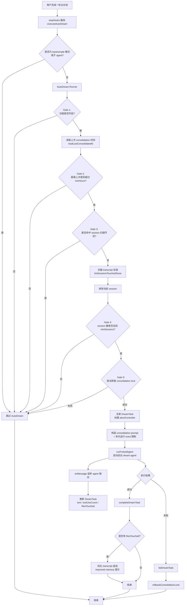
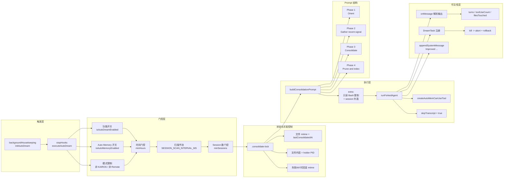
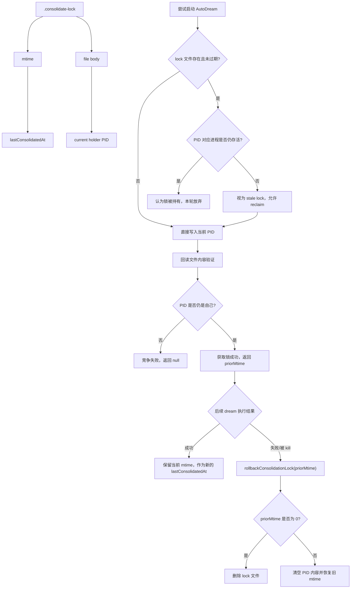
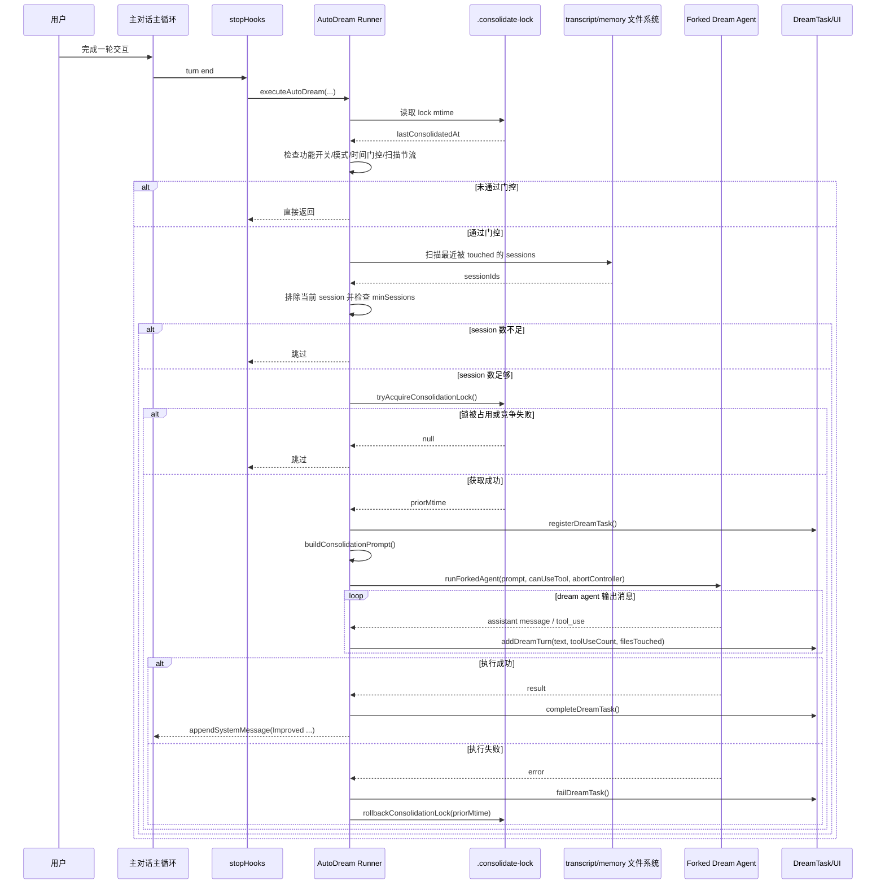

基于 `src/services/autoDream` 相关源码与任务链路整理。本报告重点落在 AutoDream 自身的实际实现。

## 1. 模块定位

AutoDream 不是普通的对话能力，而是 Claude Code 自动记忆体系中的“后台整合器”。它不会在每轮对话里直接写总结，而是在满足一定条件后，后台 fork 一个独立 agent，对 memory 目录和最近 session 进行一次“梦境式 consolidation”，把零散、过时、重复的信息整理为更稳定的长期记忆。

从调用链看：

1. 启动阶段，`startBackgroundHousekeeping()` 调用 `initAutoDream()` 完成初始化，说明它属于后台 housekeeping 能力，而非主查询循环本体。
2. 每轮 stop hook 结束时，如果当前不是 bare/simple 模式、不是子 agent，则会 fire-and-forget 调用 `executeAutoDream()`。
3. `executeAutoDream()` 本身不做业务，只转发到 `initAutoDream()` 闭包中注册的 `runner`，真正逻辑都在 `runAutoDream()` 里。

关键定位代码：

- `src/utils/backgroundHousekeeping.ts:31-38`
- `src/query/stopHooks.ts:133-156`
- `src/services/autoDream/autoDream.ts:122-125`
- `src/services/autoDream/autoDream.ts:319-323`

## 2. 核心设计目标

结合源码，AutoDream 的目标不是“保存全部对话”，而是做一次低频、高价值、可回滚的记忆整合。它试图解决几个问题：

- 背景记忆不能每轮都跑，否则代价过高。
- memory 目录是长期资产，不能让多个进程同时写。
- consolidation 失败不能把“上次成功 consolidation 时间”错误推进。
- 自动整理必须尽量复用现有 prompt/cache 基础设施，而不是新造一套执行框架。
- 整理过程要对用户可见，但不能污染主会话 transcript。

这几个目标基本决定了 AutoDream 的实现风格：少量 gate、轻量 lock、复用 forked agent、UI 上挂 task、主会话只看到简短系统消息。

## 3. 实现总览

AutoDream 的主流程可以概括为：

1. 判定功能是否开启。
2. 读取上次 consolidation 时间。
3. 做时间门控。
4. 做 session 数量门控。
5. 获取 consolidation lock。
6. 注册 DreamTask 供 UI 展示与中止。
7. 构造 dream prompt。
8. 以 forked agent 运行 consolidation。
9. 监听 agent 输出，提取文本和写入路径，更新 DreamTask。
10. 成功则完成任务并在主 transcript 追加 “Improved …” 系统消息。
11. 失败或被杀时回滚 lock 时间戳，避免错误推进状态。

其中最关键的入口实现集中在 `src/services/autoDream/autoDream.ts:122-271`。

## 4. 触发机制：不是定时器，而是 turn-end opportunistic execution

一个很重要的实现特征是，AutoDream 不是后台 cron，也不是独立守护进程，而是“每轮结束时顺手检查一次”。触发点在 stop hook：

- `src/query/stopHooks.ts:154-155` 只在主 agent 上调用 `executeAutoDream(...)`
- `src/query/stopHooks.ts:133-156` 同时说明 bare/simple 模式整体跳过 background bookkeeping

这种设计有几个实际好处：

- 不引入额外常驻线程或外部调度器。
- 与现有 query 生命周期自然对齐，工程复杂度低。
- 只有用户真的在使用 Claude Code 时才有机会触发，不浪费空闲资源。

代价也很明显：它不是严格按时运行，而是“当用户继续使用产品时，到了门槛就触发”。这是一种典型的 opportunistic background job 设计。

## 5. Gate 机制：先便宜后昂贵

源码顶部注释已经把设计讲得很清楚：按最便宜到最贵的顺序做 gate。

关键代码：

- `src/services/autoDream/autoDream.ts:5-8`
- `src/services/autoDream/autoDream.ts:125-190`

### 5.1 开关门控

`isGateOpen()` 会拦掉几类场景：

- KAIROS 模式关闭 AutoDream，因为 KAIROS 用的是另一套 disk-skill dream 路径。
- Remote mode 关闭。
- auto memory 总开关关闭。
- 最后才检查 AutoDream 自身是否启用。

对应代码：

- `src/services/autoDream/autoDream.ts:95-100`

而 `isAutoDreamEnabled()` 的优先级是：

1. 用户 `settings.json` 中显式配置 `autoDreamEnabled`
2. 否则回退到 GrowthBook feature flag `tengu_onyx_plover`

对应代码：

- `src/services/autoDream/config.ts:8-20`

这说明 AutoDream 是一个典型的“用户设置优先，实验平台兜底”的可灰度能力。

### 5.2 时间门控

`readLastConsolidatedAt()` 通过 lock 文件的 `mtime` 读取上次 consolidation 时间，缺失则返回 `0`。主逻辑里再计算：

`hoursSince = (Date.now() - lastAt) / 3_600_000`

只有 `hoursSince >= minHours` 才继续，默认是 `24h`。

对应代码：

- `src/services/autoDream/consolidationLock.ts:25-35`
- `src/services/autoDream/autoDream.ts:130-141`
- `src/services/autoDream/autoDream.ts:63-66`

### 5.3 Session 门控

时间满足后，不会立刻 dream，而是检查“自上次 consolidation 以来，有多少 session 被 touched”。实现是扫描 transcript 目录，找 `mtime > lastAt` 的 session 文件，再排除当前会话。

默认阈值是 `5` 个 session。

对应代码：

- `src/services/autoDream/consolidationLock.ts:110-124`
- `src/services/autoDream/autoDream.ts:153-171`

这里的设计很有意思：它不是按消息数，而是按“session 被触碰的数量”来估计值得不值得做 consolidation。这更接近长期记忆整理的真实信号。

### 5.4 扫描节流

还有一个容易被忽略但很关键的细节：如果时间门槛已经通过，但 session 数还不够，那么下一轮对话会再次通过时间门槛。为了避免每轮都扫 transcript 目录，源码加了 `SESSION_SCAN_INTERVAL_MS = 10min` 的节流。

对应代码：

- `src/services/autoDream/autoDream.ts:54-56`
- `src/services/autoDream/autoDream.ts:143-151`

这体现出作者对“便宜 gate 之后仍然可能出现的次优热路径”考虑得很细。

## 6. Lock 设计：mtime 既是锁，也是 lastConsolidatedAt

AutoDream 最漂亮的一段实现，在 `consolidationLock.ts`。

它没有单独维护：

- 一个 “last_consolidated_at” 状态文件
- 一个 “lock” 文件

而是把两件事合成一个 `.consolidate-lock`：

- 文件内容：当前持有者 PID
- 文件 `mtime`：上次 consolidation 时间

对应代码：

- `src/services/autoDream/consolidationLock.ts:1-5`
- `src/services/autoDream/consolidationLock.ts:16-23`
- `src/services/autoDream/consolidationLock.ts:25-45`

### 6.1 获取锁

`tryAcquireConsolidationLock()` 的流程：

1. 读旧文件的 `mtime` 和 PID。
2. 若 `mtime` 距今未超过 `HOLDER_STALE_MS` 且 PID 仍存活，则视为锁被持有。
3. 否则尝试 reclaim。
4. 写入当前进程 PID。
5. 再读一次文件内容，若 PID 不是自己，说明竞争失败，返回 `null`。
6. 返回旧的 `mtime`，供失败时回滚。

对应代码：

- `src/services/autoDream/consolidationLock.ts:46-84`

这不是重量级锁，但对该场景足够实用：轻量、跨进程、可恢复。

### 6.2 回滚

如果 forked agent 启动失败，或任务被 kill，AutoDream 会调用 `rollbackConsolidationLock(priorMtime)`：

- 之前没有文件时直接删文件。
- 否则清空 PID body，再把 `mtime` 改回去。

对应代码：

- `src/services/autoDream/consolidationLock.ts:86-108`

这点非常关键。否则只要“尝试过一次但失败”，系统就会错误地认为 consolidation 已经刚跑过，从而延后真正有价值的下一次整理。

### 6.3 为什么这个设计好

这个锁方案的核心优势有三点：

- 状态合并：一个文件同时承载“互斥锁”和“最近成功时间”。
- 失败可恢复：通过 `priorMtime` 回滚，不污染调度状态。
- 成本极低：日常检查只要一次 `stat`。

这也是 AutoDream 整个模块最体现工程成熟度的地方。

## 7. Prompt 设计：四阶段 consolidation，而不是摘要一把梭

`buildConsolidationPrompt()` 把 consolidation 明确拆成四个 phase：

1. Orient
2. Gather recent signal
3. Consolidate
4. Prune and index

对应代码：

- `src/services/autoDream/consolidationPrompt.ts:10-64`

它要求 agent：

- 先看 memory 目录和 `MEMORY.md`
- 优先读 daily logs
- transcript 只允许窄 grep，不允许整包读取
- 倾向更新已有 topic file，而不是制造重复文件
- 把相对时间转成绝对时间
- 修正被新证据推翻的旧记忆
- 控制 `MEMORY.md` 作为索引而不是内容 dump

这说明 AutoDream 的本质并非“压缩对话”，而是“维护一个可长期演化的知识库”。

### 7.1 Prompt 与权限约束解耦

自动 dream 运行时，会在 `extra` 里附加一段本次运行专属限制，明确 Bash 只能做只读操作，不能写文件或重定向。

对应代码：

- `src/services/autoDream/autoDream.ts:213-222`

源码注释也明确解释了为什么这段限制不写进共享 prompt body：手动 `/dream` 运行在主 loop 中，权限与 AutoDream 后台任务不同，写死会产生误导。

这体现出一个成熟模式：共享 prompt 只放稳定规则，运行态约束用动态 `extra` 注入。

## 8. 执行方式：复用 forked agent 框架

AutoDream 没有自己写一个专用执行器，而是直接复用通用 forked agent 基础设施：

- `runForkedAgent`
- `createCacheSafeParams`
- `createAutoMemCanUseTool`

对应代码：

- `src/services/autoDream/autoDream.ts:224-233`

核心参数含义：

- `promptMessages`: 用构造好的 consolidation prompt 作为 user message
- `cacheSafeParams`: 复用现有 cache-safe 参数构造逻辑
- `canUseTool`: 只允许 auto-memory 安全范围内的工具访问
- `querySource` / `forkLabel`: 标记来源为 `auto_dream`
- `skipTranscript: true`: 不把后台 dream 混入主 transcript
- `overrides.abortController`: 支持用户中止
- `onMessage`: 监听 forked agent 输出，反馈到 DreamTask

这一层设计的意义很大：

- AutoDream 不是“旁门左道脚本”，而是统一 agent runtime 上的一个专门工作流。
- 它自然继承缓存、安全参数、消息回调、工具权限等基础设施。
- 后续维护成本显著低于自研一套独立 dream runner。

## 9. DreamTask：让后台 agent 对用户“可见但不打扰”

如果只有后台 forked agent，用户几乎察觉不到它在做什么。Claude Code 为此专门加了 `DreamTask`，把 AutoDream 暴露到现有任务系统里。

对应代码：

- `src/tasks/DreamTask/DreamTask.ts:1-4`

### 9.1 任务状态

DreamTask 记录：

- 当前 phase：`starting` / `updating`
- 正在 review 的 session 数
- 至少被 Edit/Write 工具触碰过的文件路径
- 最近最多 30 个 assistant turn
- abortController
- `priorMtime`，供 kill 时回滚 lock

对应代码：

- `src/tasks/DreamTask/DreamTask.ts:20-40`
- `src/tasks/DreamTask/DreamTask.ts:52-74`

### 9.2 进度监听

`makeDreamProgressWatcher()` 会在每条 assistant 消息上做轻量解析：

- 收集 text block 作为用户可见进度文本
- 统计 tool_use 数量
- 只对 FileEdit/FileWrite 提取 `file_path`
- 再写入 DreamTask

对应代码：

- `src/services/autoDream/autoDream.ts:275-313`
- `src/tasks/DreamTask/DreamTask.ts:76-104`

这个设计很克制。它没有试图完整重建 dream agent 的内部状态，而是只提取“用户关心的最小可见信息”。

### 9.3 任务结束与中止

成功时：

- `completeDreamTask()`
- 如存在被触碰的文件，则通过 `appendSystemMessage()` 在主 transcript 追加一条 `Improved ...` 消息

对应代码：

- `src/services/autoDream/autoDream.ts:235-257`
- `src/tasks/DreamTask/DreamTask.ts:106-120`

失败时：

- `failDreamTask()`
- 回滚 lock 的 `mtime`

对应代码：

- `src/services/autoDream/autoDream.ts:258-270`
- `src/tasks/DreamTask/DreamTask.ts:122-129`

用户 kill 时：

- 先 `abort()`
- 标记任务为 `killed`
- 再执行 `rollbackConsolidationLock(priorMtime)`

对应代码：

- `src/tasks/DreamTask/DreamTask.ts:132-156`

这套链路很完整：调度、可见性、中止、回滚闭环都齐了。

## 10. 关键实现优势

结合源码，AutoDream 的核心优势主要有以下几项。

### 10.1 低开销触发

日常每轮只需要做极少量检查，甚至源码注释直接写了“enabled 时每轮成本是一次 GB cache read + 一次 stat”。

对应代码：

- `src/services/autoDream/autoDream.ts:315-318`

这使 AutoDream 能成为默认背景能力，而不会明显拖慢每一轮交互。

### 10.2 状态一致性强

锁与最近成功时间复用同一个文件，并且失败时显式回滚。相比很多“后台任务只要启动就记成功时间”的实现，这套方案对一致性更严谨。

### 10.3 与主会话隔离良好

`skipTranscript: true` 让后台整理不污染主对话，但又通过 DreamTask 和 `appendSystemMessage` 给用户适度反馈。这是“隔离执行 + 轻量可见性”的很稳妥实现。

### 10.4 Prompt 目标明确，不是粗暴总结

Prompt 明确要求：

- 合并重复 memory
- 修复漂移事实
- 转换绝对日期
- 修剪索引

所以它不是“把历史聊天压缩一下”，而是“维护长期知识资产”。

### 10.5 工程复用度高

AutoDream 几乎没有发明新的基础设施，而是搭在现有系统上：

- feature flag / settings
- forked agent runtime
- task registry
- auto-memory path
- analytics
- stop hooks

这类实现通常更稳定，也更容易持续演进。

## 11. 局限与边界

源码里也能看到 AutoDream 并非无懈可击，而是有一些清晰边界。

### 11.1 不是实时记忆

它是低频 consolidation，不负责每轮捕获新记忆。更像 nightly compaction，只是触发方式不是定时器而是 turn-end opportunistic。

### 11.2 session 计数是启发式

它看的是“自上次以来被 touched 的 session 数”，不是变化质量，也不是新增知识量。因此有可能：

- session 多但信号弱，也会触发
- session 少但价值高，可能暂时不触发

这是成本与精度之间的实际折中。

### 11.3 文件触碰统计不是完整真相

`DreamTask.filesTouched` 只从 FileEdit/FileWrite 工具里提取，注释明确写了：如果 dream agent 通过 bash 间接写文件，这里会漏掉，因此只能理解为“至少这些文件被触碰过”。

对应代码：

- `src/tasks/DreamTask/DreamTask.ts:29-35`

### 11.4 强依赖 memory 目录质量

AutoDream 假设 memory 目录已经存在某种结构化规范，包括 `MEMORY.md`、topic files、可能的 daily logs。它更像维护器，而不是从零到一构建知识库的万能引擎。

## 12. 与参考总结相比，应该如何理解 AutoDream

参考材料里把 AutoDream 概括为“自我进化记忆系统”，这个方向是对的，但源码显示它并不神秘，核心并不是某种新型模型能力，而是几层工程拼装后的结果：

- 触发层：turn-end + gate + throttle
- 并发层：PID lock + stale reclaim + rollback
- 执行层：forked agent + restricted tools
- 提示层：4-phase consolidation prompt
- 可见性层：DreamTask + inline completion message
- 配置层：settings 优先，GrowthBook 兜底

换句话说，AutoDream 的强点不在“会做梦”这个概念，而在它把“长期记忆整理”做成了一个成本可控、失败可恢复、对用户可见、与主会话低耦合的后台工作流。

## 13. 关键代码索引

如果只看最重要的源码，建议优先读这几段：

1. 调度主流程：`src/services/autoDream/autoDream.ts:122-271`
2. Gate 与默认阈值：`src/services/autoDream/autoDream.ts:54-100`
3. Prompt 构造：`src/services/autoDream/consolidationPrompt.ts:10-64`
4. 锁与回滚：`src/services/autoDream/consolidationLock.ts:25-108`
5. Session 扫描：`src/services/autoDream/consolidationLock.ts:110-124`
6. 可配置开关：`src/services/autoDream/config.ts:13-20`
7. 任务可见性与 kill 回滚：`src/tasks/DreamTask/DreamTask.ts:52-156`
8. 实际触发点：`src/query/stopHooks.ts:133-156`
9. 初始化位置：`src/utils/backgroundHousekeeping.ts:31-38`

## 14. 总结

从源码看，AutoDream 是 Claude Code auto-memory 体系中的“后台整理器”，不是单纯摘要器，也不是随时运行的守护进程。它通过 gate、节流、锁、回滚、forked agent 和任务系统，把长期记忆 consolidation 做成了一个低成本、可灰度、可恢复的后台流程。

它最值得借鉴的不是 prompt 文案本身，而是三个工程思想：

- 用最便宜的 gate 提前挡掉大多数无意义执行。
- 用一个轻量状态文件同时解决“互斥”和“最近成功时间”。
- 让后台 agent 与主会话隔离，但仍对用户保留最小必要可见性。

如果把 Claude Code 的记忆能力拆开看，AutoDream 负责的不是“记住”，而是“把已经积累下来的记忆重新整理为更可靠的长期结构”。这一点，正是它在整个系统中的核心价值。
