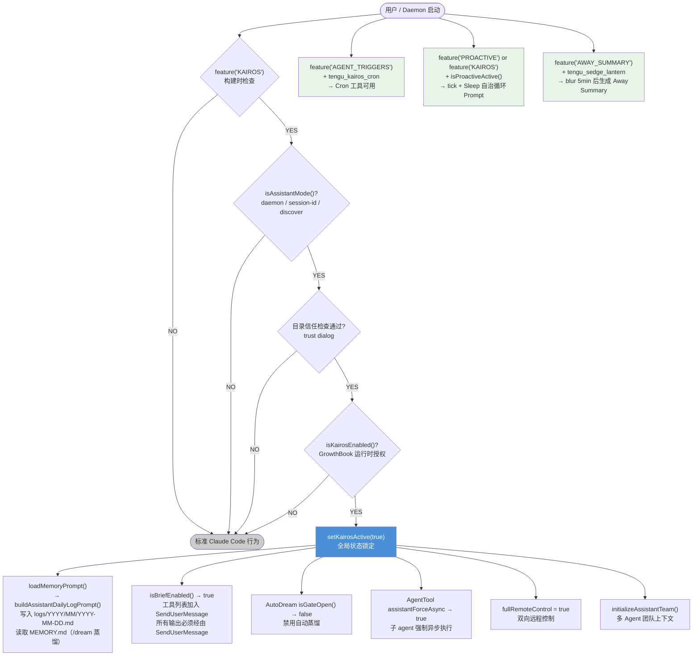

> 分析范围：KAIROS 模式核心架构、设计动机、Feature Flag 体系及关键集成

---

## 1. 概念定义：什么是 KAIROS 模式

**KAIROS**（来自古希腊语，意为"恰当的时机"）是 Claude Code 的**持续助理模式**（Assistant Mode）。它代表了 Claude Code 从「按需工具」向「长驻 AI 助理」的架构转型。

| 维度 | 标准 Claude Code | KAIROS 模式 |
|------|----------------|------------|
| **会话生命周期** | 每次交互独立，上下文截断压缩 | 持续存活，perpetual session |
| **通信方式** | 模型直接输出文本 | 必须通过 `SendUserMessage` 工具（Brief 模式） |
| **记忆写入方式** | 直接维护 MEMORY.md + topic 文件 | Append-only 日志，由 /dream skill 夜间蒸馏 |
| **背景操作** | 无 | 支持后台任务、远程控制、Channels 通知 |
| **团队记忆兼容性** | 支持（TEAMMEM） | 不兼容（append-only 日志与共享 MEMORY.md 模型冲突） |
| **AutoDream 触发** | 自动触发（forked subagent） | 跳过（由 KAIROS 专属的 /dream disk-skill 替代） |

**本质区别**：标准模式下 Claude Code 是一个「被调用的工具」；KAIROS 模式下 Claude Code 是一个「持续运行的 AI 代理」，主动维护上下文、日志和对话历史。

---

## 2. 设计动机与目标

### 2.1 核心问题：长会话上下文丢失

标准 Claude Code 的核心约束是上下文窗口有限。当对话积累足够多时，`autoCompact` 会压缩历史，导致细节丢失。对于需要跨越多个工作日、数十次对话的长期项目，这种设计难以维持连贯的工作状态。

### 2.2 设计目标

1. **持久化上下文**：通过 append-only 日志 + 夜间 /dream 蒸馏，实现跨会话的记忆延续，而不依赖 autoCompact。
2. **主动通信**：在用户不主动查询时（如完成后台任务、遇到阻塞），Claude 可以通过 `SendUserMessage` 主动联系用户。
3. **Daemon 化运行**：支持 `--session-id`、`--discover` 等守护进程启动方式，允许 Claude Code 在后台持续运行。
4. **远程控制**：天然集成 Remote Control，支持 Channels 和 GitHub Webhooks 触发任务。
5. **UI 可见性**：后台任务（dream、bash background）通过 TaskUI 在页脚展示，用户无需主动询问状态。

### 2.3 为什么叫 "KAIROS"

"KAIROS" 与"chronos"（线性流逝的时间）对立——它代表「对的时机」。KAIROS 模式的核心理念正是：Claude 知道「什么时候」应该主动记录信息、「什么时候」应该主动联系用户，而不是每次都等待指令。

---

## 3. KAIROS 与 PROACTIVE 的关系

源码中大量使用 `feature('PROACTIVE') || feature('KAIROS')` 联合判断。这两个 Flag 并非替代关系，而是分层关系。

| | PROACTIVE | KAIROS |
|-|-----------|--------|
| **本质** | 底层自治循环能力 | 面向 assistant mode 的整套产品组合 |
| **包含内容** | tick 驱动、Sleep 节流、proactive system prompt | PROACTIVE 的全部 + Brief 通信渠道 + 激活/授权路径 + 服务端会话历史 + 更强的异步化倾向 |
| **适用场景** | 实验性主动模式 | 正式的长期持续助理部署 |

**KAIROS 是在 PROACTIVE 之上的产品化封装**：它继承了自治循环（tick/Sleep）、主动工作（bias toward action）等核心行为，并额外叠加了 Brief 通信层、assistant 授权门控、服务端 session 恢复、Channels 通知等面向真实部署场景的机制。

---

## 4. Feature Flag 体系

KAIROS 功能通过两层 Flag 系统控制：**构建时 Flag**（Bun DCE）和 **运行时 GrowthBook Flag**。

### 4.1 构建时 Flag（`feature()` / `bun:bundle`）

构建时 Flag 决定代码是否被打包进二进制，保证外部发布版本不包含内部实验性代码。

| Flag | 含义 |
|------|------|
| `feature('KAIROS')` | 完整 KAIROS 助理模式，包含 assistant/index.js、assistant/gate.js |
| `feature('KAIROS_BRIEF')` | 仅 Brief 工具，不含完整助理模式（Brief 可独立于 KAIROS 发布） |
| `feature('KAIROS_CHANNELS')` | Channel 服务器通知集成 |
| `feature('KAIROS_GITHUB_WEBHOOKS')` | GitHub Webhook 订阅 |
| `feature('PROACTIVE')` | 主动模式（与 KAIROS 在多处 OR 联动，但独立存在） |

**OR 联动模式**：很多地方使用 `feature('KAIROS') || feature('KAIROS_BRIEF')`，这允许 Brief 模式在不启用完整 KAIROS 的情况下独立发布。

```typescript
// src/tools/BriefTool/BriefTool.ts:88-99
export function isBriefEntitled(): boolean {
  return feature('KAIROS') || feature('KAIROS_BRIEF')
    ? getKairosActive() ||
        isEnvTruthy(process.env.CLAUDE_CODE_BRIEF) ||
        getFeatureValue_CACHED_WITH_REFRESH('tengu_kairos_brief', false, 5min)
    : false
}
```

### 4.2 运行时 GrowthBook Flag

| Flag | 用途 | TTL | 默认值 |
|------|------|-----|--------|
| `tengu_kairos_brief` | Brief 工具 kill-switch（中途可强制关闭） | 5 min | false |
| `tengu_kairos_brief_config` | 控制 `/brief` 斜杠命令是否对用户可见 | 无 TTL | `{enable_slash_command: false}` |

注意：定时任务（Cron）系统有独立的 build-time flag `feature('AGENT_TRIGGERS')` 和 GrowthBook flag `tengu_kairos_cron`，独立于 `feature('KAIROS')` 存在（见第 8 章）。

### 4.3 环境变量

| 变量 | 效果 |
|------|------|
| `CLAUDE_CODE_BRIEF=1` | 强制授予 Brief 权限（开发/测试用途，绕过 GrowthBook） |
| `CLAUDE_CODE_DISABLE_CRON` | 禁用 Cron 调度器（优先级高于 GrowthBook） |

---

## 5. 启动与激活流程

KAIROS 模式的激活是严格门控的，分为 build-time 检查、进入条件检查、运行时权限检查三关。

### 5.1 激活条件（全部满足）

```
feature('KAIROS')                   ← 构建时：二进制中是否包含 KAIROS 代码
    AND
assistantModule.isAssistantMode()   ← 进入条件：是否以助理方式启动
    AND
目录信任检查通过                      ← 未信任目录下 KAIROS 不激活
    AND
(isAssistantForced() || isKairosEnabled())  ← 运行时：是否有权限/被强制启用
```

**目录信任要求**：源码注释明确说明，KAIROS 在未通过 trust dialog 的目录下不会被激活。原因是 `.claude/settings.json` 等项目内文件在 trust dialog 之前就可能影响 prompt 和行为，而 KAIROS 的自治强度明显高于普通模式，需要更严格的信任边界。

`isAssistantMode()` 为 true 的场景：
- 以 `--session-id` 参数启动（指定会话）
- 以 `--discover` 参数启动（发现已有会话）
- Daemon 进程启动

### 5.2 激活后的状态变更

```typescript
// src/main.tsx:1075-1076
kairosEnabled = assistantModule.isAssistantForced() || (await kairosGate.isKairosEnabled())
if (kairosEnabled) {
  setKairosActive(true)          // bootstrap/state.ts 全局状态
  // + 初始化 AssistantTeam context
}
```

`setKairosActive(true)` 是关键的运行时状态变更，它影响：
- `loadMemoryPrompt()` 的分支（切换至 append-only 日志模式）
- `isBriefEnabled()` 的判断（跳过 userMsgOptIn 检查）
- `isGateOpen()` in AutoDream（返回 false，禁止 AutoDream 触发）
- `fullRemoteControl` 的计算（自动启用远程控制）

### 5.3 团队上下文初始化

激活 KAIROS 时额外初始化 `assistantTeamContext`，使得 Agent(name: "foo") 可以生成进程内 teammates（多 Agent 协作）：

```typescript
// src/main.tsx:1086
assistantTeamContext = await assistantModule.initializeAssistantTeam()

// src/main.tsx:3035
teamContext: feature('KAIROS') ? assistantTeamContext ?? computeInitialTeamContext?.() : computeInitialTeamContext?.()
```

---

## 6. 自治工作循环：Tick、Sleep、terminalFocus

这是我原报告**完全遗漏**的核心机制，也是 KAIROS "主动工作"能力的底层基础。

### 6.1 Tick：系统心跳

**文件**：`src/constants/prompts.ts:860`（`getProactiveSection()`）

当 `feature('PROACTIVE') || feature('KAIROS')` 且 `isProactiveActive()` 为真时，系统 Prompt 会注入 `# Autonomous work` 区段，定义如下行为：

```
# Autonomous work

You are running autonomously. You will receive `<tick>` prompts that keep you alive
between turns — just treat them as "you're awake, what now?"
The time in each `<tick>` is the user's current local time.

Multiple ticks may be batched into a single message. This is normal —
just process the latest one. Never echo or repeat tick content in your response.
```

**Tick 的本质**：不是用户输入，而是系统发出的"心跳"——让 agent 在没有新用户消息时也能继续运行。外部事件（Channels 消息、定时任务触发）都可以通过 tick 机制唤醒 agent。

### 6.2 Sleep 工具：循环节流器

**文件**：`src/tools/SleepTool/prompt.ts`

`Sleep` 是 KAIROS 自治循环的节流器，也是一个真实存在的工具（工具名：`"Sleep"`）：

```typescript
// src/tools/SleepTool/prompt.ts
export const SLEEP_TOOL_NAME = 'Sleep'
// "Wait for a specified duration. The user can interrupt the sleep at any time."
// "Use this when you have nothing to do, or when you're waiting for something."
// "Each wake-up costs an API call, but the prompt cache expires after 5 minutes
//  of inactivity — balance accordingly."
```

系统 Prompt 对 Sleep 的强制要求（`prompts.ts:874`）：

> **If you have nothing useful to do on a tick, you MUST call Sleep.** Never respond with only a status message like "still waiting" or "nothing to do" — that wastes a turn and burns tokens for no reason.

Sleep 承担两个职责：
1. **控制下次唤醒时间**（Prompt cache 5 分钟失效 = 最长等待上限）
2. **避免 agent 在无事可做时消耗 API 调用**

REPL.tsx 对 Sleep 有特殊处理：当所有进行中的 tool_use 都是 Sleep 时，界面处于"静默等待"状态，不展示加载动画（`REPL.tsx:1659`）。

### 6.3 terminalFocus：感知用户是否在场

自治工作区段还定义了基于 `terminalFocus` 字段的行为调整策略：

```
terminalFocus field in user context:
- Unfocused: The user is away. Lean heavily into autonomous action —
  make decisions, explore, commit, push.
  Only pause for genuinely irreversible or high-risk actions.
- Focused: The user is watching. Be more collaborative — surface choices,
  ask before committing to large changes, keep output concise.
```

这使 Claude 能根据用户是否在场动态调整自治程度，而不是盲目地总是全速运行或总是频繁确认。

### 6.4 自治工作的行为规则

系统 Prompt 中的"Bias toward action"和"Be concise"约束（`prompts.ts:894-907`）：

- **第一次 tick**：简短问候并询问用户要做什么，不要未经指示就开始修改代码
- **后续 tick**：不要反复问同一个问题；直接行动，不要空转叙述
- **没事做时**：立即调用 Sleep，不输出"still waiting"类消息
- **文字输出**：只输出用户需要做决定或自然里程碑处的高层状态更新

---

## 7. Brief 模式：通信管道

Brief 模式是 KAIROS 中最显著的行为变化——它改变了 Claude 与用户沟通的根本方式。

### 7.1 什么是 Brief 模式

Brief 模式激活后，**模型所有用户可见输出必须通过 `SendUserMessage` 工具**（即 `BriefTool`）发送。模型直接输出的纯文本会被过滤，用户不可见。

这一设计使得：
1. Claude 可以在后台执行多步操作，只在真正需要时才通知用户
2. 可以主动（proactive）推送消息，而不只是被动响应
3. 消息有明确的 `status: 'normal' | 'proactive'` 语义区分

### 7.2 SendUserMessage 工具参数

```typescript
// src/tools/BriefTool/BriefTool.ts
{
  message: string       // 用户可见的消息，支持 Markdown
  attachments?: string[] // 附件文件路径（图片、日志、diff 等）
  status: 'normal' | 'proactive'
  // 'proactive': 主动推送（任务完成、遇到阻塞、未经请求的状态更新）
  // 'normal': 响应用户刚说的内容
}
```

### 7.3 激活路径

| 激活方式 | 场景 |
|---------|------|
| `getKairosActive() === true` | KAIROS 模式下自动激活（绕过 userMsgOptIn） |
| `--brief` CLI flag | 用户手动指定 |
| `defaultView: 'chat'` in settings.json | 配置文件指定 |
| `/brief` 斜杠命令 | 会话内动态切换 |
| `/config` 菜单 | UI 配置 |
| `CLAUDE_CODE_BRIEF=1` 环境变量 | 开发测试用途 |

### 7.4 KAIROS 下 Brief 的特殊性

在 KAIROS 模式下，系统 Prompt 硬编码了 "you MUST use SendUserMessage for all communication"，因此：
- `/brief` 命令在 KAIROS 中不注入 `<system-reminder>`（系统 prompt 已覆盖）
- 不需要 `userMsgOptIn` 状态就能激活
- `tengu_kairos_brief` 即使被 kill，`getKairosActive()` 仍保持 Brief 为 entitled

### 7.5 Brief 模式下的系统 Prompt 变化

```typescript
// src/main.tsx:2201
const briefVisibility = feature('KAIROS') || feature('KAIROS_BRIEF')
  ? isBriefEnabled()
    ? 'Call SendUserMessage at checkpoints to mark where things stand.'
    : 'The user will see any text you output.'
  : 'The user will see any text you output.'
```

---

## 8. 定时任务系统（Cron）

这是我原报告**完全遗漏**的另一个关键机制。

### 8.1 独立于 KAIROS 的 Cron 系统

定时任务系统的 build-time flag 是 `feature('AGENT_TRIGGERS')`，**不是** `feature('KAIROS')`。这是一个重要的架构区分：Cron 系统可以独立于完整 KAIROS 模式发布和使用。

```typescript
// src/tools/ScheduleCronTool/prompt.ts:36
export function isKairosCronEnabled(): boolean {
  return feature('AGENT_TRIGGERS')
    ? !isEnvTruthy(process.env.CLAUDE_CODE_DISABLE_CRON) &&
        getFeatureValue_CACHED_WITH_REFRESH('tengu_kairos_cron', true, 5min)
    : false
}
```

注意 `tengu_kairos_cron` 的**默认值是 `true`**（GA 功能，已公告于 changelog），GrowthBook 仅作为 fleet-wide kill-switch。

### 8.2 Cron 任务的两种持久性

| 类型 | 存储位置 | 重启后是否保留 |
|------|---------|--------------|
| **Session-only** | 内存 | 否 |
| **Durable** | `.claude/scheduled_tasks.json` | 是 |

Durable Cron 由 `tengu_kairos_cron_durable` GrowthBook flag 控制（默认 `true`）。

### 8.3 Cron 在 KAIROS 中的战略价值

在普通 REPL 模式中，定时任务是附加能力。在 KAIROS 的持续助理模式中，Cron 是实现"未来时间维度"的基础：

1. 助手可以安排"稍后再来做某件事"
2. 助手可以周期性检查外部状态（CI 结果、PR 状态等）
3. 助手可以在用户离开后继续推进例行工作

`useScheduledTasks.ts` 中的 `assistantMode` 参数原本用于绕过 `isLoading` 门控（避免 proactive tick → Sleep → tick 循环把 scheduler 饿死），但源码注释也说明了一个重要的历史变更：

```typescript
// src/hooks/useScheduledTasks.ts:24-26
// Assistant mode no longer forces --proactive (#20425) so isLoading drops
// between turns like a normal REPL — this bypass is now a latency nicety,
// not a starvation fix.
```

即：KAIROS 模式曾经会强制保持 proactive 激活状态（不让 isLoading 回落），但 #20425 之后改为正常 REPL 行为，`assistantMode` 对 scheduler 的影响降为延迟优化而非必要修复。

### 8.4 可用的 Cron 工具

三个 Cron 工具，均由 `isKairosCronEnabled()` 控制可见性：

- `CronCreate`：创建定时任务（一次性或周期性）
- `CronDelete`：删除指定任务
- `CronList`：列出当前活跃任务

同时提供 `/loop` disk-skill，封装了常见的周期调度用法。

---

## 9. 记忆系统在 KAIROS 下的变化

KAIROS 模式对记忆写入方式有根本性改变。完整的记忆系统架构请参见《Claude Code 记忆系统技术报告》，本节仅聚焦 KAIROS 特有部分。

### 9.1 核心差异：Append-Only 日志 vs 结构化记忆

| | 标准模式 | KAIROS 模式 |
|-|---------|------------|
| **写入目标** | 直接写 memory 目录下的 topic 文件 + MEMORY.md | 只向当天的日志文件 append |
| **日志路径** | — | `<memDir>/logs/YYYY/MM/YYYY-MM-DD.md` |
| **MEMORY.md 维护** | Claude 直接维护 | 由夜间 /dream skill 负责蒸馏 |
| **写操作模式** | 随时读写、重组 | **严格 append-only，禁止重写** |

### 9.2 日志路径的缓存设计

路径 Pattern 被刻意设计为 `logs/YYYY/MM/YYYY-MM-DD.md`（而非 inline 当天的日期字符串），原因是：

> 系统 Prompt 会被 `systemPromptSection()` 缓存。如果 inline 了具体日期，跨越午夜后缓存 prefix 失效，强制重新付费。模型从 `currentDate` 附件（在午夜翻转时 append 到对话末尾）获取当前日期，保持 prompt cache 的稳定性。

### 9.3 日志内容规范

```markdown
# 今日日志写入指引（来自 buildAssistantDailyLogPrompt）

## What to log
- 用户纠正和偏好（"use bun, not npm"; "stop summarizing diffs"）
- 用户角色、目标等用户信息
- 项目上下文（截止日期、事故、决策及其原因）
- 外部系统指针（dashboards、Linear 项目、Slack 频道）
- 用户明确要求记住的内容
```

### 9.4 为什么 KAIROS 不兼容 TEAMMEM

`loadMemoryPrompt()` 中有明确注释：

> Append-only 日志范式与团队记忆（TeamMem）不兼容——TeamMem 期望双方共享、可读写的 MEMORY.md，而 KAIROS 的日志模型不直接维护 MEMORY.md。

因此 KAIROS 分支优先于 TEAMMEM 分支被选中（`feature('KAIROS') && autoEnabled && getKairosActive()` 优先判断）。

### 9.5 "Searching past context" 扩展区段

当 `tengu_coral_fern` 开关打开时，系统 Prompt 还会追加「如何搜索历史上下文」的指引，引导模型在需要时 grep 记忆目录和 JSONL transcript 日志：

```
grep -rn "<search term>" <autoMemDir> --include="*.md"
grep -rn "<search term>" <projectDir>/ --include="*.jsonl"
```

---

## 10. 会话历史管理

KAIROS 模式引入了服务端存储的会话历史，使得跨进程恢复会话成为可能。

### 10.1 `sessionHistory.ts`

**文件**：`src/assistant/sessionHistory.ts`

该模块通过 Anthropic API 拉取指定 sessionId 的事件历史：

```typescript
// 端点格式
GET /v1/sessions/${sessionId}/events

// 分页参数
limit: number           // 每页条数（默认 100）
anchor_to_latest: true  // 拉取最新页
before_id: string       // 向更早方向翻页的游标
```

**鉴权头**：`anthropic-beta: ccr-byoc-2025-07-29`，需要 OAuth accessToken 和 orgUUID。

### 10.2 历史恢复时机

```typescript
// src/main.tsx:3259
} else if (feature('KAIROS') && _pendingAssistantChat &&
           (_pendingAssistantChat.sessionId || _pendingAssistantChat.discover)) {
  // 拉取服务端会话历史并恢复上下文
}
```

`_pendingAssistantChat` 在 `feature('KAIROS')` 下构造，包含：
- `sessionId?: string`：已知的会话 ID
- `discover: boolean`：是否自动发现已有会话

---

## 11. 背景任务与远程控制

### 11.1 全量远程控制

KAIROS 模式启动时，自动启用双向远程控制：

```typescript
// src/main.tsx:2916
const fullRemoteControl = remoteControl || getRemoteControlAtStartup() || kairosEnabled
```

这使 Daemon 进程可以接收外部指令（如 Channels 消息、GitHub Webhook 触发的任务）并将结果推回给用户。

### 11.2 Bash 后台任务注册

在 KAIROS 主线程中，`run_in_background` 默认为 false 的 Bash 任务也会被注册为可见的后台任务（展示在 UI footer）：

```typescript
// src/tools/BashTool/BashTool.tsx
if (feature('KAIROS') && getKairosActive() && isMainThread && run_in_background !== true) {
  // 注册为 background task（在 footer 可见）
}
```

### 11.3 Channels 通知

```typescript
// src/main.tsx:1642
if (feature('KAIROS') || feature('KAIROS_CHANNELS')) {
  // 启用 Channel 通知服务（MCP channel server 集成）
}
```

Channels 通知允许外部消息系统（如 claude.ai 的聊天界面）向运行中的 KAIROS 实例推送用户消息。

### 11.4 Away Summary：用户回来时的摘要

**文件**：`src/services/awaySummary.ts`、`src/hooks/useAwaySummary.ts`

Away Summary 是 KAIROS 场景下的重要配套——当用户离开终端后返回时，自动展示"while you were away"摘要卡片。

**触发条件**（全部满足）：
1. `feature('AWAY_SUMMARY')` build-time flag 开启
2. GrowthBook `tengu_sedge_lantern` 为 true（3P 默认 false）
3. 终端 blur 超过 5 分钟（`BLUR_DELAY_MS = 5 * 60_000`）
4. 当前无 turn 进行中（`isLoading = false`）
5. 自上次用户消息后尚无 away_summary（防重复）

**摘要生成**：调用轻量模型（`getSmallFastModel()`），结合近 30 条消息 + Session Memory 内容，生成 1-3 句话的任务 recap（"你在做什么 + 下一步是什么"）。

注意：Away Summary 不直接依赖 `feature('KAIROS')` 或 `kairosActive`，而是通过独立的 `feature('AWAY_SUMMARY')` + `tengu_sedge_lantern` 控制。它是 KAIROS 助理模式的自然配套，但技术上是独立功能。

### 11.5 Dream Task UI

KAIROS 中的 /dream skill（夜间记忆蒸馏）运行时，通过 `DreamTask` 在 UI footer 展示进度：

```typescript
type DreamTaskState = {
  type: 'dream'
  phase: 'starting' | 'updating'  // 检测到第一次 Edit/Write 工具调用时翻转
  sessionsReviewing: number
  filesTouched: string[]
  turns: DreamTurn[]
  abortController?: AbortController
  priorMtime: number               // 用于 abort 时回滚锁文件 mtime
}
```

用户可通过 Shift+Down 对话框 kill 正在运行的 dream。

---

## 12. 工具系统变更

KAIROS 模式对可用工具列表有如下影响：

### 12.1 新增工具

- **`SendUserMessage`（BriefTool）**：KAIROS 下自动加入工具列表，是唯一对用户可见的输出渠道。
- **`Sleep`（SleepTool）**：proactive 激活后可用，autonomous loop 的节流器。
- **`CronCreate` / `CronDelete` / `CronList`**：`feature('AGENT_TRIGGERS')` + `tengu_kairos_cron` 控制，独立于完整 KAIROS 可用。

### 12.2 工具行为变更

- **BashTool**：主线程中执行的 Bash 命令自动注册为可追踪的后台任务。
- **AgentTool**：`assistantTeamContext` 替代标准 `teamContext`，支持进程内 teammates 生成。此外，KAIROS 模式下所有 AgentTool 调用默认强制异步执行（`assistantForceAsync = kairosEnabled`）：

```typescript
// src/tools/AgentTool/AgentTool.tsx:566
const assistantForceAsync = feature('KAIROS') ? appState.kairosEnabled : false
const shouldRunAsync = (run_in_background || selectedAgent.background ||
  isCoordinator || forceAsync || assistantForceAsync || proactiveActive) && !isBackgroundTasksDisabled
```

  原因：同步 subagent 会把主循环卡住，导致输入队列堆积、cron catch-up 串行阻塞、用户输入被延后处理。KAIROS 中 agent 更像后台 worker，主线程更像协调者。

### 12.3 系统 Prompt 追加

KAIROS 可以为助理 agent 追加自定义系统 Prompt：

```typescript
// src/main.tsx:2206-2207
if (feature('KAIROS') && kairosEnabled && assistantModule) {
  const assistantAddendum = assistantModule.getAssistantSystemPromptAddendum()
  // 追加到系统 Prompt 末尾
}
```

同时在 `feature('PROACTIVE') || feature('KAIROS')` 条件下，还会向系统 Prompt 注入 `agentSystemPrompt`（自定义代理指令）：

```typescript
return asSystemPrompt([
  ...defaultSystemPrompt,
  `\n# Custom Agent Instructions\n${agentSystemPrompt}`,
  ...(appendSystemPrompt ? [appendSystemPrompt] : []),
])
```

---

## 13. KAIROS 模式下 AutoDream 的特殊处理

AutoDream（自动记忆蒸馏 forked subagent）在 KAIROS 下被**完全禁用**。

```typescript
// src/services/autoDream/autoDream.ts - isGateOpen()
function isGateOpen(): boolean {
  if (getKairosActive()) return false  // ← KAIROS 优先，直接拒绝
  // ...
}
```

**原因**：KAIROS 模式有专属的 `/dream` disk-skill（人工触发或夜间计划任务），由用户通过斜杠命令或定时任务显式触发。两者并存会造成重复蒸馏和锁竞争。

| | AutoDream（非 KAIROS） | /dream skill（KAIROS） |
|-|----------------------|----------------------|
| **触发方式** | 自动（时间门 + 会话数门） | 手动斜杠命令 / 定时 |
| **运行载体** | `runForkedAgent()` 子进程 | 主进程 disk-skill |
| **锁机制** | PID 锁文件（consolidationLock） | N/A（进程内执行） |
| **适用场景** | 短会话积累后批量蒸馏 | 长驻 KAIROS 会话的夜间整理 |

详细的 AutoDream 实现说明请参见《Claude Code 记忆系统技术报告》第 12 章。

---

## 14. 配置与开关汇总

### 14.1 全量开关一览

| 开关类型 | 名称 | 控制内容 | 默认值 |
|---------|------|---------|--------|
| Build-time | `feature('KAIROS')` | 完整 KAIROS 代码是否打包 | 内部构建 true |
| Build-time | `feature('KAIROS_BRIEF')` | Brief 工具独立打包 | 视构建目标 |
| Build-time | `feature('KAIROS_CHANNELS')` | Channels 集成 | 视构建目标 |
| Build-time | `feature('KAIROS_GITHUB_WEBHOOKS')` | GitHub Webhook | 视构建目标 |
| Build-time | `feature('AGENT_TRIGGERS')` | Cron/定时任务系统（独立于 KAIROS） | 视构建目标 |
| Build-time | `feature('AWAY_SUMMARY')` | Away Summary 功能（独立于 KAIROS） | 视构建目标 |
| Build-time | `feature('PROACTIVE')` | 底层自治循环（tick/Sleep，独立存在） | 视构建目标 |
| GrowthBook | `tengu_kairos_brief` | Brief 工具 kill-switch（5min TTL） | false |
| GrowthBook | `tengu_kairos_brief_config` | `/brief` 命令可见性 | `{enable_slash_command: false}` |
| GrowthBook | `tengu_kairos_cron` | Cron 调度器开关（kill-switch，5min TTL） | **true**（GA） |
| GrowthBook | `tengu_kairos_cron_durable` | 持久化 Cron 任务开关 | true |
| GrowthBook | `tengu_sedge_lantern` | Away Summary 功能开关 | false（3P 默认） |
| 环境变量 | `CLAUDE_CODE_BRIEF=1` | 强制授予 Brief 权限 | 未设置 |
| 环境变量 | `CLAUDE_CODE_DISABLE_CRON` | 禁用 Cron 调度器（优先于 GB） | 未设置 |
| settings.json | `defaultView: 'chat'` | 启动时自动激活 Brief | 未设置 |

### 14.2 settings.json 相关配置

```json
{
  "defaultView": "chat",           // 自动激活 Brief 模式
  "autoMemoryEnabled": true,       // 记忆系统开关（KAIROS 下也依赖此项）
  "autoMemoryDirectory": "~/path", // 自定义记忆基础路径
  "autoDreamEnabled": true         // 非 KAIROS 下的 AutoDream 开关
}
```

---

## 15. 核心数据流总览



---

## 附录：KAIROS 相关关键文件速查

| 文件 | 职责 |
|------|------|
| `src/main.tsx` | KAIROS 激活入口，`kairosEnabled` 计算，工具列表组装，远程控制启用 |
| `src/bootstrap/state.ts` | `getKairosActive()` / `setKairosActive()` 全局状态 |
| `src/assistant/sessionHistory.ts` | 服务端会话历史分页拉取 |
| `src/constants/prompts.ts` | `getProactiveSection()` tick 自治循环 Prompt，Sleep 工具引用 |
| `src/tools/BriefTool/BriefTool.ts` | `SendUserMessage` 工具实现，`isBriefEntitled()` / `isBriefEnabled()` |
| `src/tools/SleepTool/prompt.ts` | Sleep 工具定义（SLEEP_TOOL_NAME = "Sleep"），循环节流器 |
| `src/tools/ScheduleCronTool/prompt.ts` | `isKairosCronEnabled()`，Cron 工具描述，AGENT_TRIGGERS 门控 |
| `src/tools/AgentTool/AgentTool.tsx` | `assistantForceAsync = kairosEnabled`，子 agent 强制异步 |
| `src/hooks/useScheduledTasks.ts` | REPL 中的 Cron 调度器 hook，`assistantMode` 参数 |
| `src/services/awaySummary.ts` | generateAwaySummary()，模型调用生成 recap |
| `src/hooks/useAwaySummary.ts` | 终端 focus 监听，5 分钟 blur 触发 Away Summary |
| `src/commands/brief.ts` | `/brief` 斜杠命令，动态切换 Brief 模式 |
| `src/memdir/memdir.ts` | `loadMemoryPrompt()` KAIROS 分支，`buildAssistantDailyLogPrompt()` |
| `src/services/autoDream/autoDream.ts` | `isGateOpen()` 中 KAIROS 快速拒绝路径 |
| `src/services/mcp/channelNotification.ts` | Channels 通知服务（`feature('KAIROS_CHANNELS')`） |
| `src/utils/systemPrompt.ts` | KAIROS 系统 Prompt 追加逻辑 |

