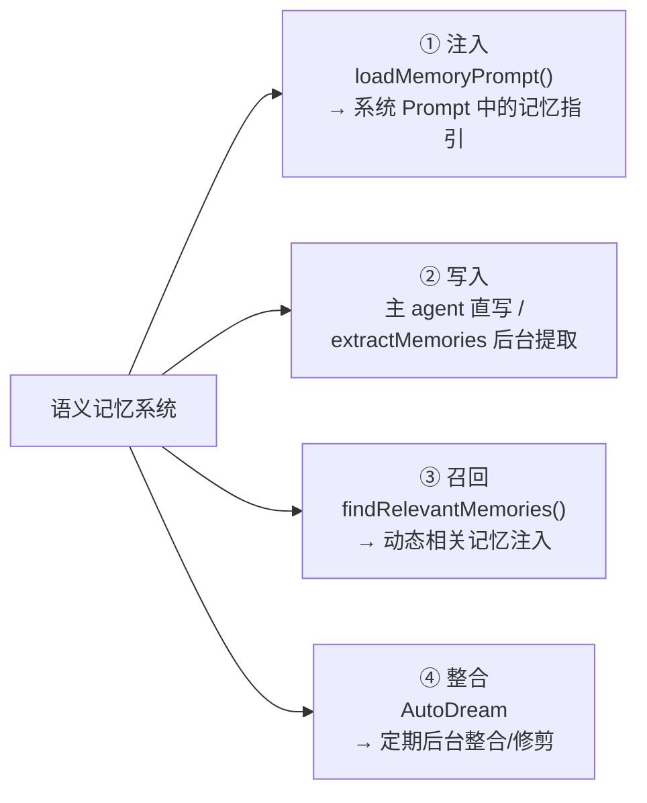
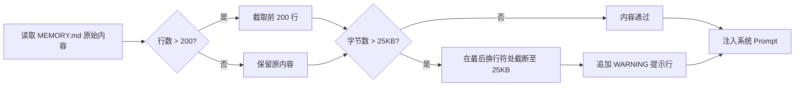
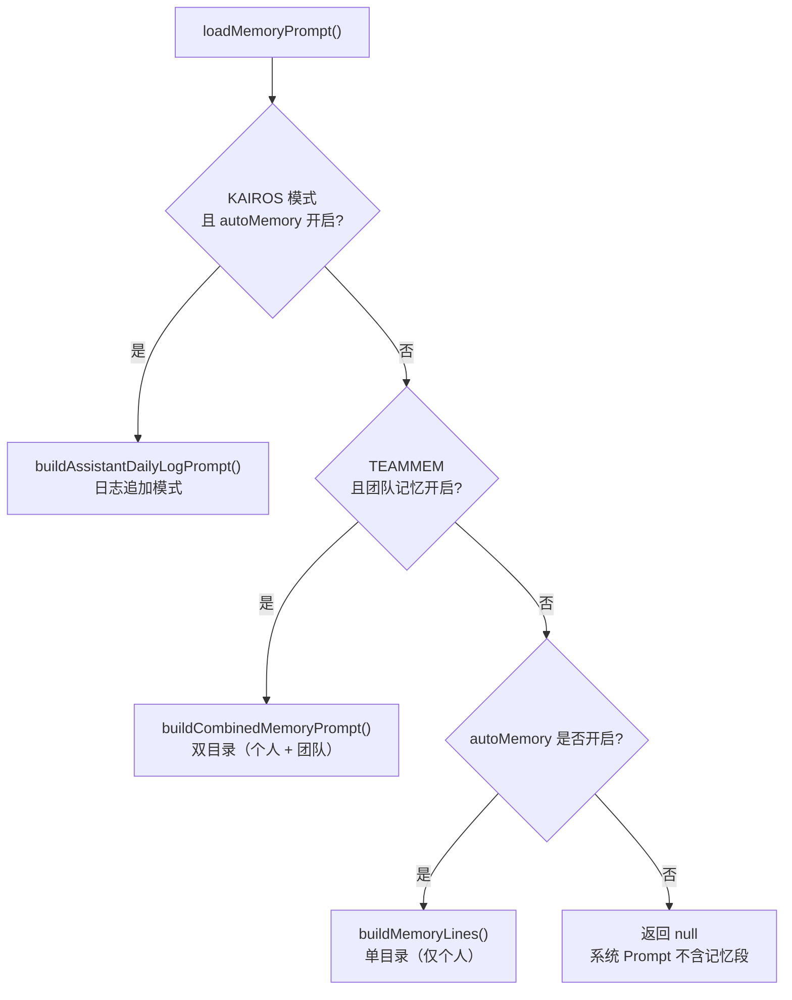
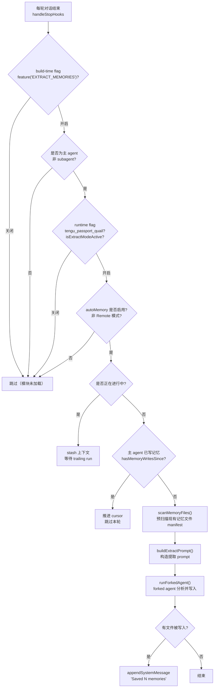
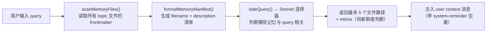
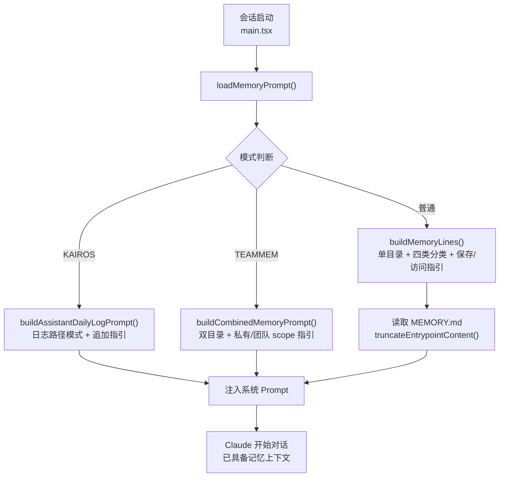
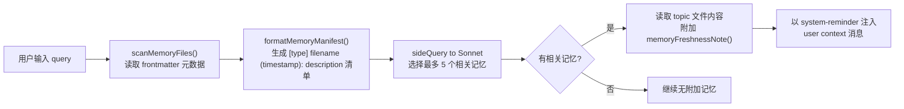
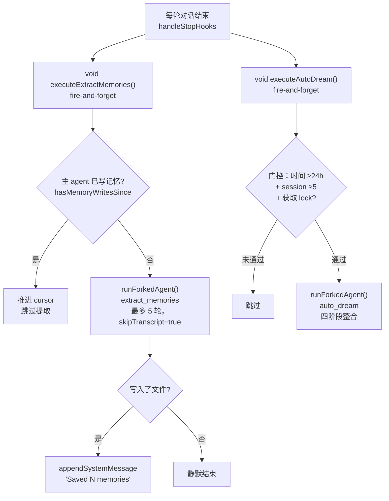

> 核心文件：`memdir/memdir.ts` · `memdir/paths.ts` · `memdir/memoryTypes.ts` · `memdir/memoryScan.ts` · `memdir/memoryAge.ts` · `memdir/findRelevantMemories.ts` · `memdir/teamMemPaths.ts` · `services/extractMemories/extractMemories.ts` · `services/extractMemories/prompts.ts`

---

## 1. 系统定位

Claude Code 的记忆系统是一套**基于文件的持久化知识库**，使 Claude 能在跨会话、跨时间的场景下保留对用户、项目和工作偏好的理解。

与"聊天历史"不同，记忆系统的目标是保存**不可从代码库或 git 历史直接推导**的信息：用户的工作方式偏好、项目的非技术背景决策、指向外部系统的指针等。这些内容会在每次会话启动时通过系统 prompt 注入，让 Claude 无需每轮重新学习就能保持连贯性。

### 记忆的三个层次

在深入各子机制之前，需要区分 Claude Code 中三类不同性质的"记忆"：

| 层次 | 载体 | 作用域 | 核心文件 |
|------|------|--------|----------|
| **指令记忆** | `CLAUDE.md`（项目/全局） | 跨会话，静态 | `src/utils/claudemd.ts` |
| **语义记忆** | `memory/` 目录下 topic 文件 | 跨会话，动态增长 | `src/memdir/` |
| **会话记忆** | session memory 文件 | 当前会话，随会话消亡 | `src/services/SessionMemory/` |

- **指令记忆**：开发者/用户手动维护的 `CLAUDE.md` 文件，定义规范、架构约束、行为规则——"怎么做"；通过 `/memory` 命令在编辑器中打开修改。
- **语义记忆**：本报告的核心——Claude 在对话中**自动学习并持久化**的结构化知识，在所有会话间复用。
- **会话记忆**：针对**当前会话**的上下文压缩快照，跨会话不复用；目的是在上下文窗口有限时保留关键信息。

整个**语义记忆**系统由以下四个子机制共同构成：



---

## 2. 文件系统结构

### 2.1 路径体系

记忆目录的解析遵循以下优先级链（先匹配先生效）：

```
1. CLAUDE_COWORK_MEMORY_PATH_OVERRIDE 环境变量（Cowork 全路径覆盖）
2. settings.json 中的 autoMemoryDirectory 字段（支持 ~/ 展开）
   ← 仅信任 policy / local / user 级别；projectSettings 被排除（安全考量）
3. 默认路径：<memoryBase>/projects/<sanitized-git-root>/memory/
   其中 memoryBase = CLAUDE_CODE_REMOTE_MEMORY_DIR 或 ~/.claude
```

`sanitized-git-root` 由 `sanitizePath(findCanonicalGitRoot(cwd))` 生成：优先使用 git 仓库的**规范根目录**（而非 worktree 路径），确保同一仓库的所有 worktree 共享同一个记忆目录。

路径解析函数 `getAutoMemPath()` 使用 `memoize` 以 `projectRoot` 为键缓存，避免渲染路径中每次 tool-use 消息重建时产生重复的文件系统调用。

### 2.2 目录布局

```
~/.claude/
└── projects/
    └── <sanitized-git-root>/        ← 例：__Users_alice_myproject
        └── memory/                  ← getAutoMemPath() 返回值（带尾部 /）
            ├── MEMORY.md            ← 入口索引（≤200行，≤25KB）
            ├── .consolidate-lock    ← AutoDream 锁文件（mtime = 上次整合时间）
            ├── user-profile.md      ← topic 文件（类型：user）
            ├── feedback-testing.md  ← topic 文件（类型：feedback）
            ├── project-goals.md     ← topic 文件（类型：project）
            ├── team/                ← 团队记忆子目录（TEAMMEM feature flag）
            │   ├── MEMORY.md
            │   └── <team-topic>.md
            └── logs/                ← KAIROS 模式日志目录
                └── YYYY/MM/YYYY-MM-DD.md
```

**安全设计**：`validateMemoryPath()` 对所有路径做严格校验，拒绝相对路径、根目录、Windows 盘符根、UNC 路径、null 字节注入。`isAutoMemPath()` 在写入时做归属校验，防止路径遍历。

---

## 3. 记忆类型分类体系

### 3.1 四类分类

记忆系统采用**封闭式四类分类法**，在 `memoryTypes.ts` 中定义，所有记忆文件必须属于其中一类：

| 类型 | 内容 | 何时保存 | 如何使用 |
|------|------|----------|----------|
| `user` | 用户的角色、目标、知识背景 | 了解用户身份/偏好时 | 裁剪回答的深度和角度 |
| `feedback` | 工作方式的正反馈（纠正与确认） | 用户纠正行为 **或** 明确认可某个非显然选择时 | 保持行为一致性，不需用户重复指导 |
| `project` | 进行中的工作、决策背景、截止日期 | 了解代码/git 历史无法推导的项目信息时 | 更准确地理解需求背后的动机 |
| `reference` | 指向外部系统的指针（Linear、Grafana 等） | 了解特定外部资源的位置时 | 知道去哪里查找信息 |

**团队模式扩展（`TYPES_SECTION_COMBINED`）**：每种类型额外添加 `<scope>` 字段，区分 `private`（仅本人可见）与 `team`（项目协作者共享）。`user` 类型始终私有；`project` 类型强烈偏向 team；`feedback` 类型默认私有，仅在明确的项目级约定时才设为 team。

### 3.2 不应保存的内容

`WHAT_NOT_TO_SAVE_SECTION` 定义了明确排除项，即使用户明确要求保存也不应写入记忆：

- 代码模式、架构、文件路径、项目结构（可从当前代码库读取）
- git 历史、近期变更（`git log` / `git blame` 是权威来源）
- 调试解决方案或修复配方（fix 在代码里，上下文在 commit message 里）
- 已在 CLAUDE.md 中记录的内容
- 临时性任务细节：进行中的工作、当前会话状态

> 设计动机：这条边界确保记忆系统存储的是"人类判断"而非"机器可推导事实"，避免记忆膨胀为代码库副本。

### 3.3 记忆文件格式

每个 topic 文件使用 frontmatter 标注元信息：

```markdown
---
name: {{记忆名称}}
description: {{一行描述——用于相关性判断，需具体}}
type: {{user | feedback | project | reference}}
---

{{记忆正文——feedback/project 类型推荐结构：结论 + **Why:** + **How to apply:**}}
```

`description` 字段至关重要：`findRelevantMemories()` 的选择器模型仅凭 filename + description 判断相关性，不读取正文。描述越精确，被正确召回的概率越高。

---

## 4. 入口索引 MEMORY.md

### 4.1 索引结构与约束

`MEMORY.md` 是整个记忆系统的**导航索引**，而非正文内容存储：

```markdown
- [记忆名称](filename.md) — 一句话摘要
- [另一条记忆](another.md) — 另一句话摘要
```

每条索引项 ≤150 字符，不写正文，正文在各 topic 文件中。`MEMORY.md` 在每次会话启动时被加载进系统 prompt，因此必须保持精简。

### 4.2 双重截断保护机制

`truncateEntrypointContent()` 在 `MEMORY.md` 被加载时同时执行行数和字节数双重截断：

```
MAX_ENTRYPOINT_LINES = 200  （行数上限）
MAX_ENTRYPOINT_BYTES = 25_000  （约 25KB，字节上限）
```

截断策略：
1. **先按行截断**（自然边界），取前 200 行
2. **再按字节截断**：若截断后仍超 25KB，在最后一个换行符处切断，不截断行中间
3. 任一限制触发时，追加 `> WARNING:` 提示行，说明触发原因

字节上限的设计动机：防止少量极长索引行（>200字符/行）绕过行数检查但仍撑爆上下文（实测曾观察到 <200 行却高达 197KB 的情况）。



---

## 5. 记忆注入：System Prompt 中的记忆

### 5.1 loadMemoryPrompt 的分发逻辑

`loadMemoryPrompt()` 是每次会话启动时构建记忆 prompt 的核心入口，根据当前启用的 feature 决定走哪条路径：



所有路径在创建目录前先调用 `ensureMemoryDirExists()` 确保目录存在，保证 agent 可以直接写入而无需先检查或创建。

### 5.2 buildMemoryLines 构建的 Prompt 结构

`buildMemoryLines()` 生成的记忆指引 Prompt 包含以下固定段落（按序）：

| 段落 | 来源 | 内容 |
|------|------|------|
| `# auto memory` 头部 | 硬编码 | 记忆目录路径 + 系统存在声明 |
| `## Types of memory` | `TYPES_SECTION_INDIVIDUAL` | 四类分类详细说明 + 示例 |
| `## What NOT to save` | `WHAT_NOT_TO_SAVE_SECTION` | 明确排除项 |
| `## How to save memories` | 条件生成 | 两步保存流程 / frontmatter 格式 |
| `## When to access memories` | `WHEN_TO_ACCESS_SECTION` | 触发时机 + 忽略指令处理 |
| `## Before recommending from memory` | `TRUSTING_RECALL_SECTION` | 记忆验证要求（文件/函数存在性） |
| `## Memory and other forms of persistence` | 硬编码 | 与 Plan/Tasks 的边界区分 |
| `## Searching past context` | `buildSearchingPastContextSection()` | grep memory 和 transcript 的命令（feature flag 控制） |
| `## MEMORY.md` | `buildMemoryPrompt()` | 截断后的 MEMORY.md 内容（或"当前为空"提示） |

**`skipIndex` 变体**：当 feature flag `tengu_moth_copse` 开启时，`How to save memories` 段改为单步保存（只写 topic 文件，不要求维护 MEMORY.md 索引），对应在线实验中测试无索引时的记忆质量。

### 5.3 KAIROS 模式：日志追加变体

KAIROS 模式（长期存在的 assistant 会话）下，记忆系统切换为**日志追加**而非实时索引更新：

```
记忆写入路径：<autoMemPath>/logs/YYYY/MM/YYYY-MM-DD.md
```

- agent 在工作过程中将值得记录的信息**追加**到当日日志文件（短小时间戳 bullet 格式）
- **不直接编辑** MEMORY.md 或 topic 文件
- 日志为 append-only，不做重组
- 每天滚动到新文件（通过 `currentDate` 上下文感知日期变化）
- `MEMORY.md` 仍存在并被加载，但由夜间独立的 `/dream` 定期从日志蒸馏生成

日志路径使用**模式字符串**（而非今天的实际日期）注入 Prompt，目的是保持系统 Prompt 的 cache prefix 在跨午夜时保持不变，避免因日期字符串变化导致 prompt cache 失效。

---

## 6. 记忆的写入

### 6.1 主 agent 直接写入

系统 Prompt 中的记忆指引让主 agent（Claude 的主对话实例）在对话中随时可以直接写入记忆文件。写入使用 `FileWriteTool` 或 `FileEditTool`，路径必须在 `autoMemPath` 内（由 `isAutoMemPath()` 校验）。

直接写入的路径绕过了常规的 `DANGEROUS_DIRECTORIES` 检查，这是记忆目录作为"受信任写入区域"的特权。

**互斥机制**：`extractMemories` 子 agent 在检查到主 agent 已在当轮写过记忆时，会跳过本轮提取（`hasMemoryWritesSince()`），确保两者不会重复写入同一内容。

### 6.2 extractMemories 自动后台提取

`extractMemories` 是记忆系统最重要的**自动写入机制**：在每轮对话结束后（`handleStopHooks` 触发），以后台 forked agent 形式分析对话内容，提取值得持久化的记忆。

#### 执行流程



#### 闭包作用域状态

`initExtractMemories()` 将所有可变状态封装在闭包中，避免模块级变量污染测试：

| 状态变量 | 类型 | 作用 |
|----------|------|------|
| `lastMemoryMessageUuid` | `string \| undefined` | 游标：记录上次提取处理到哪条消息 |
| `inProgress` | `boolean` | 互斥锁：防止同时运行两次提取 |
| `pendingContext` | `object \| undefined` | 暂存：inProgress 时收到的新触发请求 |
| `turnsSinceLastExtraction` | `number` | 节流计数：配合 `tengu_bramble_lintel` flag |
| `inFlightExtractions` | `Set<Promise>` | 追踪所有未完成的提取 Promise |

**Trailing run 机制**：若提取正在进行时收到新触发，新上下文被 stash；当前提取完成后的 `finally` 块自动执行一次 trailing run，处理两次调用之间新增的消息——始终以最新上下文为准（多次 stash 只保留最后一个）。

#### 提取 Prompt 设计

`buildExtractAutoOnlyPrompt()` 生成的 prompt 要求 forked agent：

1. **预注入 manifest**：`scanMemoryFiles()` 的结果在 prompt 构造时已列入（agent 不需要自己 `ls`）
2. **高效轮次策略**：第1轮并行发出所有 `FileRead`，第2轮并行发出所有 `FileWrite/Edit`，硬上限 5 轮
3. **范围限制**：只能使用最近 N 条消息的内容，不得 grep 源码或 git 查询验证
4. **工具约束**：允许 Read/Grep/Glob/只读 Bash，以及目录内的 FileEdit/FileWrite；其他一律拒绝

---

## 7. 记忆的召回

### 7.1 MEMORY.md 的系统级加载

`MEMORY.md` 是记忆系统的**常驻上下文**：每次会话启动时，`loadMemoryPrompt()` 将其截断后的内容注入系统 Prompt 的 `## MEMORY.md` 段落，主 agent 无需显式操作即可获得记忆索引。

这是记忆的"被动召回"路径——agent 在理解用户意图、选择工作方式时自然参考记忆，无需特别触发。

### 7.2 findRelevantMemories 动态相关记忆注入

除了静态注入 MEMORY.md 外，系统还有一条**动态相关记忆召回**路径：

```typescript
findRelevantMemories(query, memoryDir, signal, recentTools, alreadySurfaced)
```

工作流程：



选择器模型（默认 Sonnet）的 system prompt 要求：
- 只返回**明确有用**的记忆（不确定则不选）
- 最多 5 个
- 如果 query 中已在使用某工具，跳过该工具的参考文档类记忆（避免噪音），但保留包含警告/已知问题的记忆（正在使用时恰恰最需要）
- `alreadySurfaced` 参数过滤已在前几轮注入过的文件，让选择器专注于新候选

`scanMemoryFiles()` 的单次扫描策略：`readFileInRange` 内部同时返回内容和 mtime，避免先 stat 排序再读取的双倍 syscall。扫描结果按 mtime 倒序排列，最多返回 200 个文件。

### 7.3 startRelevantMemoryPrefetch：非阻塞预取模式

当 `tengu_moth_copse`（skipIndex 实验）开启时，动态召回切换为**非阻塞预取**模式：

```typescript
// src/utils/attachments.ts
export function startRelevantMemoryPrefetch(
  messages: ReadonlyArray<Message>,
  toolUseContext: ToolUseContext,
): MemoryPrefetch | undefined
```

关键设计：

1. **fire-and-forget 启动**：在 `query.ts` 的 query 循环入口用 `using` 关键字（`Disposable` 协议）绑定预取句柄，离开 query 循环时自动取消（`[Symbol.dispose]`）
2. **非阻塞**：预取在后台并发执行，主 query 不等待其完成
3. **结果消费**：预取完成后的结果通过 `filterDuplicateMemoryAttachments(attachments, readFileState)` 去重后注入——`readFileState` 缓存中已出现过的文件路径不会重复注入
4. **取消联动**：prefetch 使用 `createChildAbortController(toolUseContext.abortController)` 创建子控制器，用户按 Escape 时立即取消 sideQuery，无需等待 `using` 销毁

单词 query（无空格）会提前 bail out（不足以提取有意义的搜索词），避免无效 sideQuery 调用。

> 为什么用 `tengu_moth_copse` 同时控制 skipIndex 和预取？
> skipIndex 模式下不维护 MEMORY.md，静态 MEMORY.md 注入失去索引价值；
> 预取恰好补充了无索引时的相关记忆召回能力，两者形成配套实验。

---

## 8. 记忆新鲜度机制

`memoryAge.ts` 提供了一套记忆**过期感知**机制，防止 Claude 将陈旧记忆当作当前事实断言：

```typescript
memoryAge(mtimeMs)          // "today" | "yesterday" | "N days ago"
memoryFreshnessText(mtimeMs) // 超过 1 天时返回明确的过期警告文本
memoryFreshnessNote(mtimeMs) // 同上，包裹在 <system-reminder> 标签中
```

超过 1 天的记忆会携带如下提示注入上下文：

```
This memory is N days old. Memories are point-in-time observations, not live state —
claims about code behavior or file:line citations may be outdated.
Verify against current code before asserting as fact.
```

这一机制的设计动机来自用户反馈：带有 `file:line` 引用的陈旧记忆会让 Claude 的断言听起来更权威，但实际上代码可能已经变化。通过显式的过期提示，引导 Claude 在推荐前先验证记忆中提到的文件/函数是否仍然存在。

`TRUSTING_RECALL_SECTION` 进一步强化了这一约束：

> "The memory says X exists" is not the same as "X exists now."

---

## 9. 权限沙箱：createAutoMemCanUseTool

记忆系统的所有后台 agent（extractMemories、AutoDream）都使用 `createAutoMemCanUseTool(memoryDir)` 作为统一的权限沙箱：

| 工具 | 权限 | 限制条件 |
|------|------|----------|
| `FileRead` / `Grep` / `Glob` | ✅ 完全允许 | 无（只读，无风险） |
| `Bash` | ✅ 有条件允许 | 必须通过 `BashTool.isReadOnly()` 检查（ls/find/cat/stat 等） |
| `FileEdit` / `FileWrite` | ✅ 有条件允许 | 路径必须在 `autoMemPath` 内（`isAutoMemPath()` 验证） |
| `REPL` | ✅ 允许（外壳） | 内部调用的原子工具仍经过同一沙箱检查 |
| 其他所有工具 | ❌ 拒绝 | 包括 Agent、TodoWrite、Web、写入型 Bash 等 |

**REPL 放行的原因**：在 ant 原生构建中，原子工具（Read/Bash/Edit/Write）被隐藏，agent 通过 REPL 调用它们；如果把 REPL 从工具列表中裁掉，会破坏 prompt cache 共享（工具列表是 cache key 的一部分）。真正的安全边界在原子工具层，REPL 外壳的放行不影响安全性。

每次工具被拒绝时，系统触发 `tengu_auto_mem_tool_denied` 遥测事件（携带脱敏工具名），为 Anthropic 收集"记忆 agent 在真实场景下尝试使用哪些工具"的观测数据。

---

## 10. 团队记忆（Team Memory）

### 10.1 目录结构

团队记忆是个人记忆目录的**子目录**，由 `TEAMMEM` feature flag 控制：

```
memory/
├── MEMORY.md          ← 个人记忆索引
├── user-profile.md
├── feedback-testing.md
└── team/              ← 团队记忆（getTeamMemPath()）
    ├── MEMORY.md      ← 团队记忆索引
    └── team-conventions.md
```

团队记忆必须在个人记忆开启的前提下才能启用（`isTeamMemoryEnabled()` 先检查 `isAutoMemoryEnabled()`）。团队目录的 `mkdir -p` 会顺带创建父级的个人目录。

### 10.2 Scope 分级

团队模式下，`TYPES_SECTION_COMBINED` 为每种记忆类型附加 `<scope>` 指引：

- `user`：**始终 private**，个人敏感信息不共享
- `feedback`：**默认 private**，仅明确的项目级约定才设为 team
- `project`：**强烈偏向 team**，项目背景应让所有协作者可见
- `reference`：**通常 team**，外部系统指针对团队都有价值

### 10.3 路径安全

团队记忆目录的写入经过**两轮路径校验**（`validateTeamMemWritePath()` / `validateTeamMemKey()`）：

1. **第一轮**：`path.resolve()` 消除 `..` 段，字符串层面确认路径在 teamDir 内
2. **第二轮**：`realpathDeepestExisting()` 解析符号链接，确认真实文件系统位置在 teamDir 内

第二轮检查专门防御**符号链接逃逸**（PSR M22186）：攻击者若在 team 目录内放置指向 `~/.ssh/authorized_keys` 的符号链接，仅靠 `path.resolve()` 无法检测，必须用 `realpath` 解析链接目标后再验证。

---

## 11. Session Memory（会话记忆压缩）

Session Memory 是一套**当前会话内**的上下文压缩机制，与跨会话的语义记忆（`memdir/`）完全独立。

**核心区别**：
- 语义记忆（`memdir/`）：跨会话持久化，保存不可推导的人类判断
- Session Memory：仅当前会话有效，以 forked agent 方式维护一份"压缩笔记"，目的是在上下文窗口消耗殆尽前仍保留关键决策

### 11.1 触发阈值

`DEFAULT_SESSION_MEMORY_CONFIG`（`sessionMemoryUtils.ts`）定义了三个默认触发条件：

| 参数 | 默认值 | 含义 |
|------|--------|------|
| `minimumMessageTokensToInit` | 10,000 | 首次初始化所需最低 token 数 |
| `minimumTokensBetweenUpdate` | 5,000 | 两次更新之间的最小 token 增量 |
| `toolCallsBetweenUpdates` | 3 | 两次更新之间所需的最少 tool call 次数 |

三个条件同时满足才触发一次压缩。阈值可通过 GrowthBook 动态配置（`tengu_sm_config`）覆盖。

### 11.2 执行机制

触发后，Session Memory 以 `forkLabel: 'session_memory'` 启动一个 forked subagent：

```typescript
// src/services/SessionMemory/sessionMemory.ts
runForkedAgent({
  querySource: 'session_memory',
  forkLabel: 'session_memory',
  skipTranscript: true,  // 不写入 session transcript
  ...
})
```

**权限沙箱**（`createMemoryFileCanUseTool(memoryPath)`）：写入权限被精确限制到单一 session memory 文件路径，完全隔离于语义记忆目录。

### 11.3 生命周期

Session memory 文件随会话创建，会话结束时不自动删除，但路径绑定到当前 session ID（`getSessionMemoryPath()`），下次新会话不复用。它不会被 AutoDream 扫描，不会出现在语义记忆的 `MEMORY.md` 索引中。

### 11.4 Feature Flag

Session Memory 由 `tengu_session_memory` GrowthBook flag 控制（`isSessionMemoryGateEnabled()`），默认关闭（`false`）。

---

## 12. 记忆整合：AutoDream（简介）


AutoDream 是记忆系统的**后台定期整合机制**，独立于实时提取运行：

- **触发条件**：距上次整合 ≥24 小时 且 累计 ≥5 个新 session
- **工作内容**：四阶段 consolidation——定向（Orient）→ 采集信号（Gather）→ 整合（Consolidate）→ 修剪索引（Prune）
- **与 extractMemories 的关系**：互补而非重复。extractMemories 负责"实时追加"，AutoDream 负责"定期整理"，如同"实时笔记"与"定期整理笔记本"的分工

AutoDream 的详细实现（门控机制、锁设计、Prompt 结构）参见专题报告。

---

## 13. 开关与配置体系

### 13.1 isAutoMemoryEnabled 的优先级链

```typescript
// Path: src/memdir/paths.ts
// 优先级从高到低，第一个命中的返回：
1. CLAUDE_CODE_DISABLE_AUTO_MEMORY=1  → false（禁用）
2. CLAUDE_CODE_DISABLE_AUTO_MEMORY=0  → true（显式启用）
3. CLAUDE_CODE_SIMPLE（--bare 模式）  → false
4. CLAUDE_CODE_REMOTE 且无 REMOTE_MEMORY_DIR → false（CCR 无持久存储）
5. settings.json 中 autoMemoryEnabled  → 取设置值
6. 默认                                → true（开启）
```

### 13.2 用户可配置项

| 配置项 | 位置 | 说明 |
|--------|------|------|
| `autoMemoryEnabled` | `settings.json` | 启用/禁用整个记忆系统 |
| `autoMemoryDirectory` | `settings.json`（非 projectSettings） | 自定义记忆目录路径 |
| `autoDreamEnabled` | `settings.json` | 启用/禁用后台 AutoDream |

### 13.3 Feature Flags

| Flag | 类型 | 作用 |
|------|------|------|
| `EXTRACT_MEMORIES` | **build-time**（`feature()`） | extractMemories 模块编译开关；关闭时模块不加载，相关 `require()` 返回 `null` |
| `tengu_passport_quail` | runtime GrowthBook | extractMemories 后台提取运行时总开关（`isExtractModeActive()` 的双重门之一） |
| `tengu_bramble_lintel` | runtime GrowthBook | extractMemories 轮次节流（默认每轮提取一次） |
| `tengu_moth_copse` | runtime GrowthBook | skipIndex 模式（不维护 MEMORY.md 索引）+ 启用 `startRelevantMemoryPrefetch` |
| `tengu_coral_fern` | runtime GrowthBook | "Searching past context" 段落开关 |
| `tengu_onyx_plover` | runtime GrowthBook | AutoDream 开关 + minHours/minSessions 参数 |
| `tengu_session_memory` | runtime GrowthBook | Session Memory 功能总开关（默认 false） |
| `tengu_sm_config` | runtime dynamic config | Session Memory 阈值配置（tokenInit / tokenUpdate / toolCalls） |
| `KAIROS` | build-time | 日志追加模式（assistant 永久会话） |
| `TEAMMEM` | build-time | 团队记忆功能 |
| `tengu_herring_clock` | runtime GrowthBook | 团队记忆 GrowthBook 实验开关 |
| `MEMORY_SHAPE_TELEMETRY` | build-time | 记忆召回形状遥测 |

---

## 14. 核心数据流总览

### 14.1 会话启动：记忆注入



### 14.2 对话中：动态记忆召回



### 14.3 对话结束：记忆提取与整合



---

## 附录：关键文件速查

| 文件 | 职责 |
|------|------|
| `memdir/paths.ts` | 路径解析（`getAutoMemPath`）、开关判断（`isAutoMemoryEnabled`）、路径安全校验 |
| `memdir/memdir.ts` | Prompt 构建（`buildMemoryLines`、`buildMemoryPrompt`、`loadMemoryPrompt`）、MEMORY.md 截断 |
| `memdir/memoryTypes.ts` | 四类分类定义、frontmatter 格式、不保存规则、访问时机、新鲜度校验指引 |
| `memdir/memoryScan.ts` | 扫描目录（`scanMemoryFiles`）、生成 manifest（`formatMemoryManifest`） |
| `memdir/memoryAge.ts` | 记忆新鲜度计算（`memoryAge`、`memoryFreshnessText`、`memoryFreshnessNote`） |
| `memdir/findRelevantMemories.ts` | 动态召回选择（`findRelevantMemories`、`selectRelevantMemories`） |
| `memdir/teamMemPaths.ts` | 团队记忆路径（`getTeamMemPath`）、双轮路径安全校验（symlink 防御） |
| `services/extractMemories/extractMemories.ts` | 自动提取主逻辑（`initExtractMemories`、`executeExtractMemories`）、工具沙箱（`createAutoMemCanUseTool`） |
| `services/extractMemories/prompts.ts` | 提取 agent prompt 构建（`buildExtractAutoOnlyPrompt`、`buildExtractCombinedPrompt`） |
| `services/autoDream/autoDream.ts` | 后台整合调度（参见 AutoDream 专题报告） |
| `services/SessionMemory/sessionMemory.ts` | 会话记忆压缩主逻辑（`shouldExtractMemory`、`extractSessionMemory`）、触发阈值判断 |
| `services/SessionMemory/sessionMemoryUtils.ts` | Session Memory 配置（`DEFAULT_SESSION_MEMORY_CONFIG`）、状态管理工具函数 |
| `utils/attachments.ts` | `startRelevantMemoryPrefetch`（非阻塞预取）、`filterDuplicateMemoryAttachments`（去重） |
| `utils/memoryFileDetection.ts` | 统一记忆文件检测：`isAutoManagedMemoryFile`、`memoryScopeForPath`、`isMemoryDirectory`、`isShellCommandTargetingMemory` |
| `commands/memory/memory.tsx` | `/memory` 命令：在外部编辑器中打开 CLAUDE.md 指令记忆文件 |

